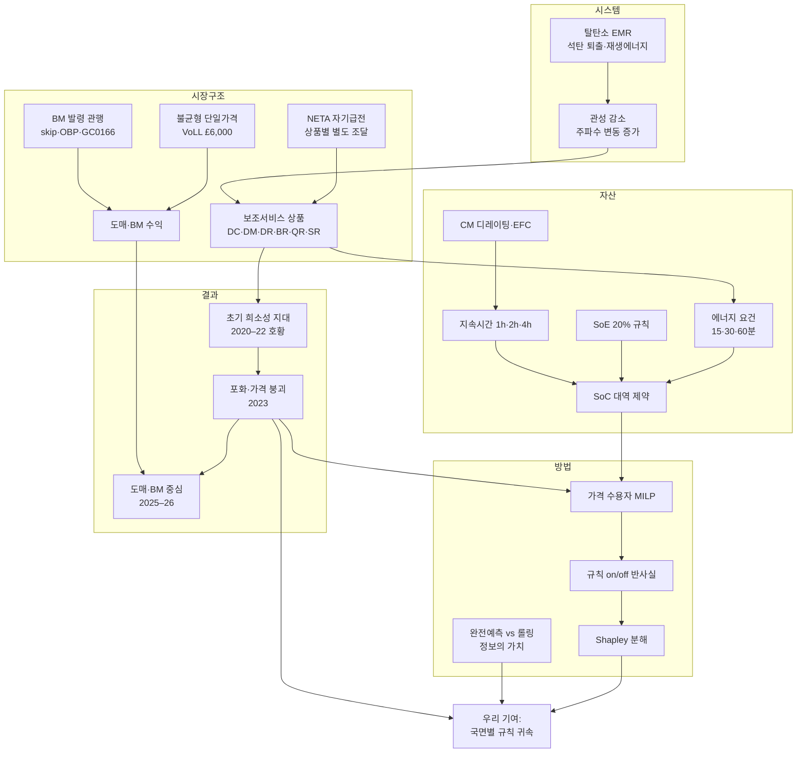

# 연구자 학습 가이드 — 영국 시장, 논문 아카이브, 주제 연결 지도

작성 2026-10-08. 이 문서는 **연구를 하려면 직접 머리에 넣어 둬야 하는 것**만 모았습니다. 세부 자료는 각 장 끝에 적은 파일에 있습니다.

## 읽는 순서

1. **1장 연구 한 장 요약**: 무엇을 왜 하는지
2. **2장 영국 시장**: 모델을 만들려면 반드시 알아야 하는 개념 11개
3. **4장 주제 연결 지도**: 흩어진 주제들이 서로 어떻게 이어지는지 (이 문서의 핵심)
4. **3장 논문 아카이브**: 무엇을 어떤 순서로 읽고, 각 논문에서 무엇을 뽑아낼지
5. **5–7장**: 연구 설계와 연결, 직접 해 볼 연습, 자가 점검 질문
6. **8–9장**: 직접 확인해야 할 미확인 사항, 용어집

---

## 1. 연구 한 장 요약

**질문.** 영국 시장의 어떤 상품 규칙이 계통용 배터리를 수익 사업으로 만들었나? 각 규칙은 수익성과 입찰·운전 전략을 얼마나 바꾸나?

**왜 영국인가.** 짧은 기간에 국면이 뚜렷하게 바뀌어서 규칙과 수익의 관계를 보기 좋습니다.

| 시기 | 배터리 수익 지수 (£k/MW/yr) | 무슨 일이 있었나 |
|---|---|---|
| 2016 | — | EFR 입찰로 진입 |
| 2022 | 156 (정점) | DC 호황 |
| 2023 | 51 (−67%) | DC 포화로 가격 붕괴 |
| 2025 | 약 70 | 도매·BM 중심으로 회복 |

**지금까지 정리된 것.**
- 연구 설계 v0(`docs/00_research_design_v0.md`)와 설계 검토(`docs/01_next_actions.md`)
- 논문 114편 아카이브(`literature/`)
- 영국 시장 변천사(`literature/context/`)
- 데이터: EAC 경매 2023.11–2026.10, 용량시장, Elexon 2026년 9월 샘플(`data/`)

**경쟁 상황.** 2026년에 Imperial(Staffell 그룹)과 Oxford(Morstyn·Howey 그룹)가 거의 같은 영역의 논문을 냈습니다.
- Gale 외 2026: 도매 + BM, skip rate
- Landy 외 2026: 한 모델로 여러 나라 비교
- Xia 외 2026(프리프린트): EAC 상품 + SoE 규칙 + 열화

**그래서 남은 우리 자리는 셋입니다.**
1. 규칙을 하나씩 켜고 끄는 반사실로 수익을 **규칙별로 나누기**(Shapley 분해)
2. 같은 규칙의 가치가 **국면에 따라 어떻게 다른지**(2021–22 호황 vs EAC 이후)
3. BM 채택 확률을 **데이터로 추정**하기

> 한 문장으로: **"입찰 최적화 연구는 규칙을 고정된 환경으로 두고, 시장설계 연구는 수익을 정성적으로 다뤘다. 우리는 규칙을 변수로 두고 수익을 규칙별로 나눈다."**

---

## 2. 영국 시장 — 반드시 이해해야 할 개념 11개

각 개념마다 ① 무엇인가 ② 배터리에게 왜 중요한가 ③ 모델에서 어떻게 쓰이나를 적었습니다.

### 2.1 시장의 뼈대: 자기급전과 별도 조달

- **무엇**: 2001년 NETA 이후 영국 발전사는 스스로 운전 계획을 세우고(자기급전), 상대거래나 거래소에서 전기를 사고팝니다. 실시간 1시간 전(게이트 마감)에 최종 계획을 **FPN**(Final Physical Notification)으로 계통운영자(NESO)에게 제출합니다. 그 뒤의 수급 조정은 NESO가 **밸런싱 메커니즘(BM)**으로 합니다.
- **배터리에게**: 미국 ISO처럼 중앙에서 에너지와 예비력을 함께 최적화하지 않습니다. NESO가 보조서비스를 **상품별로 따로 사기 때문에** 배터리가 상품마다 가용성 요금을 받고, 여러 상품을 겹쳐서(stacking) 받을 수 있습니다.
- **모델에서**: 배터리 운영자가 시장 순서대로 결정합니다(D-1 경매 → 일중 거래 → BM). 미국 논문(S3·S7 갈래 다수)의 "공동최적화 시장" 가정을 그대로 가져오면 안 됩니다.

### 2.2 시간 단위 세 가지

| 단위 | 길이 | 어디에 쓰이나 |
|---|---|---|
| **결제구간(SP)** | 30분, 하루 48개 (서머타임 전환일 46/50개) | 도매, 불균형 정산, BM, BR·QR·SR |
| **EFA 블록** | 4시간, 하루 6개, 영국 현지시각 23:00 시작 | DC·DM·DR |
| **주파수** | 1초 | DC·DM·DR 응답, SoC 변화 |

- **모델에서**: 기본 해상도를 30분으로 두고 EFA 블록은 4시간 = 8개 SP로 묶습니다. EAC 데이터는 UTC, Elexon은 현지시각 기준이므로 처음부터 **UTC 30분 단일 인덱스**로 맞춰야 합니다.

### 2.3 밸런싱 메커니즘(BM)

- **무엇**: 게이트 마감 뒤 NESO가 유닛(BMU)에 출력을 바꾸라고 지시(BOA)하는 시장입니다. 유닛은 미리 가격 사다리를 냅니다(BOD).
  - **offer** = 출력을 늘리는 가격. 배터리라면 방전을 늘리거나 충전을 줄이는 것이고, NESO가 그 값을 지급합니다.
  - **bid** = 출력을 줄이는 가격. 배터리라면 방전을 줄이거나 충전을 늘리는 것입니다.
  - 지급 방식은 **pay-as-bid**(자기가 낸 가격을 받음)입니다.
- **배터리에게**: 지금 수익의 핵심입니다. 다만 싸게 냈는데도 지시를 받지 못하는 일(**skip**)이 많았습니다. 이를 줄이려는 개혁이 이어졌습니다.
  - 2023.12 일괄발령 플랫폼(OBP)
  - 2024.3 30분 규칙
  - 2024.12 skip rate 공개
  - 2025.10 GC0166 승인(배터리가 실제 에너지 한계를 신고)
- **모델에서**: 설계 v0의 `(1−skip rate)×가격×물량` 식은 틀렸습니다(`docs/01_next_actions.md` M2). skip rate는 시스템 전체를 사후에 집계한 값이지, 내 offer가 채택될 확률이 아니기 때문입니다. 대신 비슷한 배터리가 실제로 받은 BM 수익을 쓰거나, BOD/BOALF 데이터로 채택 확률을 추정해야 합니다.

### 2.4 불균형 정산(cash-out)

- **무엇**: 계획(FPN)과 실제 출력의 차이를 정산하는 가격입니다.
  - 2015.11부터 매도·매수 가격이 같은 **단일가격**입니다.
  - 2018.11부터 가장 비싼 1 MWh의 조치로 가격을 정합니다(PAR 1 MWh).
  - 수요를 끊을 때 쓰는 정전비용 **VoLL은 £6,000/MWh**입니다. VoLL은 가격 상한이 아니라, 예비력 희소가격(RSP = 정전확률 LoLP × VoLL)을 계산하는 입력값입니다.
  - 계통 전체가 부족(short)하면 가격이 높고, 남으면(long) 낮습니다. 그 방향을 나타내는 값이 **NIV**(순불균형량)입니다.
- **배터리에게**: 계통에 도움이 되는 방향으로 불균형을 내면 보상받습니다. 도매·불균형 거래 수익의 바탕입니다.
- **모델에서**: 정산가격으로 완전예측 차익거래를 돌리면 값이 비현실적으로 큽니다. 2026년 9월 2시간 배터리 기준 £161k/MW/yr로, 실제로 거래할 수 있는 가격이 아니므로 **상한 중의 상한**으로만 씁니다.

### 2.5 도매시장

- **무엇**: 거래 경로는 하루 전 경매(EPEX·N2EX 시간 경매, EPEX 30분 경매)와 일중 연속거래입니다.
- **데이터 제약**:
  - 하루 전 경매가격은 유료입니다.
  - 무료 대용은 Elexon **MID**(APX 단기 거래 가중평균)입니다. N2EX MID는 99.6%가 거래량 0이라 쓸 수 없습니다.
  - MID는 하루 전 경매가격이 아니므로, 하루 전 가격을 쓴 Gale 2026과는 직접 비교할 수 없습니다.
- **모델에서**: MID는 "단기 시장 가격"으로 이름을 정확히 붙입니다. 2026년 9월 MID 기준 2시간 배터리 완전예측 차익거래는 약 £74k/MW/yr입니다(처리량 비용 £10/MWh).

### 2.6 주파수 응답: DC·DM·DR

| 상품 | 성격 | 응답 속도 | 응답 곡선 | 필요 에너지 | 출시 |
|---|---|---|---|---|---|
| **DC** (Dynamic Containment) | 사고 후 | 0.5초 개시, 1초 전량 | ±0.015 Hz까지 0%, ±0.2 Hz에서 5%, ±0.5 Hz에서 100% | **15분** | 2020.10 (Low), 2021.11 (High) |
| **DM** (Moderation) | 사고 전 | 1초 | ±0.1 Hz에서 5%, ±0.2 Hz에서 100% | **30분** | 2022.5 |
| **DR** (Regulation) | 사고 전, 상시 조정 | 10초 | ±0.2 Hz에서 100%로 선형 | **60분** | 2022.4 |

- **Low / High**: Low는 주파수가 떨어질 때 출력을 늘리는 상품이고(방전), High는 주파수가 오를 때 출력을 줄이거나 흡수하는 상품입니다(충전).
- **배터리에게**: 2020–22년 수익의 대부분이었습니다. DC는 필요량(약 1–1.5 GW)이 계통 상황으로 정해져서, 배터리가 많아지자 가격이 무너졌습니다. 2023년 5월 DCL 평균 £1.37/MW/h는 출시 때 상한 £17의 10분의 1도 안 됩니다.
- **모델에서**: 상품마다 **출력 여유**와 **에너지 여유**를 함께 비워 둬야 합니다(2.11장 예시). 이것이 층 1 MILP의 핵심 제약입니다.

### 2.7 예비력: BR·QR·SR

| 상품 | 응답 | 유지 | 출시 | 메모 |
|---|---|---|---|---|
| **BR** (Balancing Reserve) | 10분 이내 | 30분 (1시간 배터리는 SoC 50% 이상 필요) | 2024.3 | 2025.10부터 EAC 14시 경매에 편입 |
| **QR** (Quick Reserve) | 1분 이내 | 약 13–15분 (출처마다 다름) | 2024.12 (BM 유닛), 2025.9 (비BM) | Fast Reserve 대체 |
| **SR** (Slow Reserve) | 15분 이내 | **120분** | 2026.3.31 | STOR 대체. 첫 경매에서 가스가 약 75% |

- **배터리에게**: 유지 시간이 길수록 짧은 배터리는 불리합니다. SR은 사실상 2시간 이상 배터리나 가스의 몫입니다.

### 2.8 EAC 경매와 SoE 규칙

- **EAC**(2023.11.2~): D-1 14:00에 DC·DM·DR(2025.10부터 BR·QR도)을 **한 경매에서 공동최적화**합니다.
  - 낙찰은 단일가격(**pay-as-clear**)입니다.
  - £0 하한이 없어져 **음(−)의 가격**도 나옵니다. 저장소 데이터 기준 DRH 낙찰의 85%가 음가격입니다.
  - 한 유닛이 여러 상품을 나눠(splitting) 맡을 수 있습니다.
- **SoE 규칙**(2024): DC·DM·DR을 맡은 배터리는 결제구간마다 계약 에너지(REV)의 20% 이상을 회복할 수 있어야 합니다. EFA 블록 시작 때 에너지가 부족하면 가용하지 않은 것으로 봅니다(지급 없음).
- **2026.7**: FPN을 제출하지 않은 BM 유닛은 DC·DM·DR에 참여할 수 없습니다.
- **모델에서**: "EAC 공동최적화"와 "SoE 규칙"은 규칙 스위치 후보입니다. 끄면 각각 "블록마다 상품 하나만 선택", "회복 제약 없음"이 됩니다.

### 2.9 용량시장(CM)

- **무엇**: 4년 전(T-4)과 1년 전(T-1)에 경매하고, £/kW/yr로 지급합니다. 그 대가로 계통 위기 때 출력할 의무가 있고, 못 하면 벌금을 냅니다. 신규 설비는 최대 15년 계약을 받습니다.
- **디레이팅**: 설비용량 중 몇 %를 "확실한 용량"으로 인정하는지입니다.
  - 2017.12에 지속시간별로 바뀌었습니다. 0.5시간 배터리는 약 96%에서 약 21%가 됐습니다.
  - 그 뒤 EFC(등가확정용량) 방식으로 계산합니다.
  - 2시간 배터리(실제로 열린 T-4 경매 기준): 0.486(2024/25) → 0.154(2027/28) → 0.220(2029/30, 산정 방식 개편으로 일부 회복)
  - 2022/23 T-4의 0.567은 용량시장 중단으로 경매가 열리지 않은 값이니 쓰면 안 됩니다.
- **가격**: £0.77–75까지 크게 출렁였습니다. 2026.3 T-4는 £27.10, T-1은 £5였습니다.
- **배터리에게**: 디레이팅이 지속시간 선택을 바꿉니다. 최근 사전자격 심사에서는 4시간 이상 자산이 배터리 인정 용량의 절반을 넘었습니다.
- **모델에서**: 운전과 거의 상호작용하지 않는 고정 수입입니다(£/kW × 디레이팅). **Shapley 분해 밖에서 더하는 층**으로 둡니다.

### 2.10 망요금과 비용 쪽 규칙

| 요금 | 무엇 | 저장장치에 생긴 변화 |
|---|---|---|
| **TNUoS** | 송전망 이용료 | Triad(겨울 최대 수요 3개 구간) 혜택이 2018–21년 축소됨. TCR로 고정비(잔여요금)를 "최종 소비(Final Demand)"에만 부과하게 되어 저장장치는 제외 |
| **BSUoS** | 계통운영비 | 2023.4부터 수요에만 부과 → 배터리 방전에는 부과 안 됨 |
| **DUoS** | 배전망 이용료 | 잔여요금이 2022.4부터 최종 소비 고정요금으로 바뀜 |
| 면허·인허가 | — | 저장장치를 발전의 한 종류로 정의(2020 면허, 2023 법). 대형 저장장치가 국가 중요 인프라 인허가에서 빠짐(2020.12) |

- **배터리에게**: 이중 부과를 없앤 것이 새 수익만큼 중요했습니다. **비용 쪽 규칙도 시장설계**입니다.
- **모델에서**: 반사실 분석에 망요금 규칙을 넣을지 정해야 합니다. 넣는다면 £/MWh 비용 항으로 넣습니다.

### 2.11 수익 스택이 실제로 합쳐지는 방식 (가상 예시)

> 아래 숫자는 이해를 돕기 위한 **가상 예시**입니다. 가격은 저장소 EAC 데이터의 2023.11–2026.10 중앙값입니다.

배터리 50 MW / 100 MWh가 한 EFA 블록(4시간)에서 **DCL 30 MW**와 **DRL 10 MW**를 팔았다고 합시다. 둘 다 Low(방전) 상품입니다.

| 확인할 것 | 계산 | 결과 |
|---|---|---|
| 방전 방향 출력 여유 | 30 + 10 MW | 40 MW를 비워둬야 함 → 도매·BM에 쓸 방전 출력은 **10 MW**만 남음 |
| 충전 방향 출력 여유 | Low 상품은 충전 여유가 필요 없음 | 충전은 **50 MW**까지 가능 |
| SoC 하한 | DCL 30 MW × 0.25h + DRL 10 MW × 1h | **17.5 MWh** 이상 유지 |
| SoE 20% 규칙 | 결제구간마다 위 에너지의 20%를 회복할 수 있어야 함 | 사건 뒤 SoC를 되돌릴 충전 여유 필요 |
| 가용성 수입 | 30 × £2.15 × 4h + 10 × £10.94 × 4h | 약 **£696 / 블록** |

여섯 블록 모두 같다고 단순 가정하면 연 약 £1.5m, 즉 약 £30k/MW/yr입니다. 남은 출력 10 MW와 SoC 17.5–100 MWh 범위로 도매·BM에서 추가 수익을 냅니다. 설계 v0 5장의 제약식이 정확히 이 계산입니다.

```
방전 출력:  p_t + Σ(Low 상품 MW) ≤ P
충전 출력: −p_t + Σ(High 상품 MW) ≤ P
에너지:    Σ(Low MW × 필요시간) ≤ SoC_t ≤ E − Σ(High MW × 필요시간)
```

### 2.12 숫자로 기억할 것

| 항목 | 값 |
|---|---|
| 첫 상업 진입 | 2016.8 EFR 입찰, 201 MW, 4년 계약, £7.00–11.97/MW/h |
| DC 출시 가격 | 2020.10, 상한 £17/MW/h (연 약 £15만/MW) |
| DC 포화 | 2023.5 DCL 평균 £1.37/MW/h. DCH 참여 가능 2,229 MW vs 필요 1,099 MW |
| 수익 지수 | 2020년 65 → 2021년 123 → 2022년 156 → 2023년 51 → 2024년 약 50 → 2025년 약 70 (£k/MW/yr, Modo, 산정 방식 여러 번 바뀜) |
| 설비 | 2022년 1.93 GW / 2.24 GWh → 2025년 6.8 GW / 11 GWh → 2026년 2분기 7.6 GW |
| 정부 목표 | 2030년 배터리 23–27 GW + 장주기 4–6 GW |
| 불균형 정산 | 단일가격, PAR 1 MWh, VoLL £6,000/MWh |
| Gale 2026 | BM 참여 시 도매 단독 대비 최대 +250%, skip rate +10%p마다 이익 −7% (약 £12k/MW/yr) |
| EAC 중앙 낙찰가 (£/MW/h) | DCL 2.15, DML 5.05, DRL 10.94, DRH −5.66, PQR 3.46, PBR 2.14, PSR 2.16 |

**더 볼 곳**: `literature/context/GB_market_history_KO.md`(변천사), `GB_market_history_EN.md` 3장(상품 사양 표), `data/README.md`(데이터 해설).

---

## 3. 논문 아카이브 — 무엇을 어떤 순서로 읽나

### 3.1 폴더 지도

| 파일 | 언제 여나 |
|---|---|
| `literature/INDEX.md` | 논문 찾을 때. 갈래별 표, 분위 표기(Q1 / Q1~ / Q1? / Q2!) |
| `literature/papers/<id>.md` | 논문 하나를 깊게 볼 때. 11개 항목(질문, 가정, 모델을 강제한 제약, 모델, 데이터 가공, 정당화, 결과, 한계, 관련성, 계보, 검증기록) |
| `literature/streams/S1–S8.md` | 한 갈래의 흐름과 공백을 볼 때 |
| `literature/LINEAGE.md` | 우리 연구의 위치, 가장 가까운 연구 17편의 모델링 방식 비교 |
| `literature/GROUPS.md` | 연구 그룹·사제 계보 |
| `literature/CANON.md` | 교과서, 리뷰, 관례를 만든 논문 |
| `literature/WATCHLIST.md` | 경쟁 논문, 프리프린트 |
| `literature/DOWNLOAD_LIST.md` | 내려받을 논문 25편 |

**근거 수준을 꼭 보세요.** 각 파일의 `evidence_read`가 `abstract`이면 초록만 읽은 것입니다. 그런 파일의 수치는 논문 본문으로 확인하기 전에는 인용하면 안 됩니다. 114편 중 45편이 초록 수준입니다.

### 3.2 8개 갈래를 한 줄씩

| 갈래 | 묻는 질문 | 대표 논문 | 우리 연구에서 쓰는 곳 |
|---|---|---|---|
| **S1 가치·경제성** (22편) | 저장장치는 얼마나 가치가 있나 | walawalkar2007, sioshansi2009, staffell2016, schmidt2019 | 완전예측 상한 + 현실 하한의 사다리, 비용 가정 |
| **S2 수익 스택** (18편) | 여러 서비스를 어떻게 겹치나 | he2011, shi2018, biggins2022, mirzaeialavijeh2025, casella2024 | 층 1 MILP의 구조, 규칙을 제약식으로 옮기는 법 |
| **S3 불확실성 하 입찰** (16편) | 모르는 가격 앞에서 어떻게 입찰하나 | conejo2002, krishnamurthy2018, kim2021_vss, lohndorf2013 | 층 2(롤링·확률계획), 정보의 가치 |
| **S4 열화** (17편) | 수명 손실을 어떻게 비용으로 넣나 | xu2018_cycleagingcost, he2018, collath2023 | 열화 비용 설정(규칙과 무관하게 고정) |
| **S5 강화학습** (15편) | 학습으로 입찰하면 어떤가 | cao2020, ye2020, li2024 | **쓰지 않는 이유**의 근거(seed 분산, 약한 기준선) |
| **S6 보조서비스 상품** (20편) | 상품 사양이 배터리 운전·수익을 어떻게 바꾸나 | greenwood2017, gundogdu2018, lee2019, fan2025, engels2019 | **규칙 스위치 후보 목록**(S6 5장 표) |
| **S7 시장설계** (24편) | 규칙을 바꾸면 결과가 어떻게 달라지나 | sioshansi2017, bhattacharjee2022, williams2022, mercier2023, landy2026 | **규칙 귀속 방법론**(S7 5장의 P1–P7 패턴) |
| **S8 실증** (12편) | 실제 배터리는 어떻게 행동하고 무엇을 바꿨나 | lamp2022, rangarajan2023, butters2025 | 관측 vs 최적 비교, 사건연구 설계 |

### 3.3 반드시 직접 읽을 논문 16편과 뽑아낼 것

**A. 영국 직계** (먼저)

| # | 논문 | 근거 수준 | 뽑아낼 것 |
|---|---|---|---|
| 1 | staffell2016_maxvalue | full | GB 수익 스택의 원형. 예측 없이도 완전예측 수익의 75–95%를 회수한다는 결과 → "상한이 의미 있다"는 정당화 논리. 예비력(STOR)을 겹치면 수익이 약 3배 |
| 2 | biggins2022_tradeornot | full | FFR 30분 유지 의무를 **SoC 대역 제약으로 옮기는 방식**. 낙찰 불확실성을 무시하면 수입이 28% 과대평가됨 |
| 3 | greenwood2017_efrservicedesign | abstract → 내려받기 | "상품 사양이 배터리 적합성을 정한다"는 우리 가설의 직계 조상 |
| 4 | fan2025_dccolocatedreforms | full | DC 규칙(15분 에너지, 20% 회복, 기준선)을 모델에 넣은 방식. 데드밴드 표기 오류 주의 |
| 5 | martins2021_ukbusinessmodels | abstract → 내려받기 | DC 이전 영국 사업모델의 기준선(회수기간 3.3년, 6.6년) |
| 6 | casella2024_ukbessmilp | abstract → 내려받기 | 영국 규칙을 MILP로 옮긴 Q1 선례. 우리 층 1과 직접 비교 |
| 7 | gale2026_balancingbatteries | abstract → 내려받기 | **경쟁 C1**. 무엇을 했고 무엇을 안 했는지 |
| 8 | landy2026_hybridstacking | abstract → 내려받기 | **경쟁 C2**. 나라 비교를 어떤 단위로 했는지(규칙 단위인가, 시장 접근 묶음인가) |

**B. 방법론**

| # | 논문 | 근거 수준 | 뽑아낼 것 |
|---|---|---|---|
| 9 | kim2021_vss | full | "실시간 조정이 자유롭고 가격 수용자이면 확률적 입찰의 추가 가치(VSS)는 0에 가깝다". 영국은 EAC가 D-1에 확정되므로 0이 아닐 수 있음 |
| 10 | krishnamurthy2018_dart | abstract → 내려받기 | DA·RT 2단계 확률계획. 층 2의 기준 |
| 11 | xu2018_cycleagingcost | full | 사이클 깊이별 열화 비용을 구간선형 MILP로. 열화를 무시하면 자산이 약 1년 만에 망가짐 |
| 12 | bhattacharjee2022_soemanagement | full | **같은 자산·같은 시나리오에서 규칙만 요인설계로 바꾸기**. 우리 Shapley 설계와 가장 가까운 선례 |
| 13 | williams2022_marketpower | full | GB에서 시장지배력 원천을 2×2 반사실로 분리. 차익거래만으로는 고정비 회수가 어려움 |

**C. 실증·균형**

| # | 논문 | 근거 수준 | 뽑아낼 것 |
|---|---|---|---|
| 14 | lamp2022_caisobatteryarbitrage | full | 실제 배터리 행동을 완전예측 LP와 비교하는 설계. 실제 배터리는 가격 상위 구간에서만 반응 |
| 15 | rangarajan2023_batteryfcasdid | abstract | 배터리 진입이 보조서비스 가격을 낮췄다는 DiD(호주). 영국 DC 포화의 비교 사례 |
| 16 | butters2025_soakingsun | full | 배터리 집단의 가격 영향을 넣은 균형 모형. 확률적 운영이 완전예측의 약 70% |

### 3.4 경쟁 논문과 우리가 다른 점

| 경쟁 | 그들이 한 것 (초록 기준) | 우리가 다른 점 |
|---|---|---|
| C1 Gale 2026 (Imperial) | 도매 + BM, skip rate를 모수로 | EAC 보조서비스 포함, 규칙별 귀속, 국면 비교, 채택 확률 실증 추정 |
| C2 Landy 2026 (Imperial) | 한 모델로 여러 지역, "입지보다 시장 접근" | 시장 접근 "묶음"이 아니라 **개별 규칙** 단위. 독립형 배터리. 국면 의존성 |
| C3 Xia 2026 (Oxford, 프리프린트) | EAC 상품 겹치기 + SoE 규칙 + 열화, 롤링 호라이즌 | 규칙을 실험 변수로. BM·용량시장 층 |
| C4 Dalton & O'Sullivan 2026 (프리프린트) | BM 가격 결정에서 배터리 비중(유닛 단위) | 우리는 수익성. 이 논문은 가격 수용자 가정의 한계를 보여주는 **인용 근거** |
| C5 Nosratabadi 2024 (프리프린트) | 저장장치가 밸런싱 비용·배출에 주는 영향 | 시스템 관점이 아니라 사업자 수익 관점 |

### 3.5 계보 한눈에 (GROUPS.md 요약)

- **Staffell 계열** (Imperial CEP): staffell2016 → Schmidt & Staffell 2023(교과서) → Gale 2026, Landy 2026. **우리 연구가 서는 줄기**입니다.
- **Oxford 계열** (Morstyn, Howey): Xia 2026, Nosratabadi 2024. 엔진(모델) 쪽 경쟁자입니다.
- **최적화 입찰 정통 계열**: Conejo 학파(Morales, Pineda, Baringo, Kazempour), Oren 학파(Sioshansi, Papavasiliou), Kirschen → Bolun Xu. S3·S4·S7의 뼈대입니다.
- **영국 정책 계열**: Newbery, Green(Cambridge EPRG, Imperial), Strbac(Imperial). 사제 관계는 대부분 미확인입니다.

### 3.6 분위 표기 읽는 법

| 표기 | 뜻 | 편수 |
|---|---|---|
| `Q1` | 발행연도에 Q1 확인 | 82 |
| `Q1~` | 가장 가까운 연도, 또는 앞뒤 해(±1년)로 Q1 확인 | 7 |
| `Q1?` | 발행연도 미확인 → 인용 전에 확인 | 22 |
| `Q2!` | 기준 미달 → 남길지 결정 필요(staffell2016은 계보의 출발점이라 예외로 남길지 판단) | 3 |

---

## 4. 주제 연결 지도 (마인드브릿지)

흩어진 주제들이 **어떤 논리로 이어지는지**를 그림 하나와 다리 16개로 정리했습니다. 연구 중에 "이건 왜 중요하지?"가 막히면 여기서 해당 다리를 찾으세요.

### 4.1 전체 그림



### 4.2 다리 16개

각 다리는 **파편 A ↔ 파편 B**, 연결 논리, 근거, 연구에서의 쓰임 순서입니다.

**① 탈탄소 ↔ 빠른 주파수 상품의 필요**
- 논리: 석탄이 빠지고 재생에너지가 늘면 계통 관성이 줄고, 주파수가 빠르게 크게 흔들립니다. 그래서 1초 안에 반응하는 자원이 필요해졌고, 배터리가 가장 쌉니다.
- 근거: 변천사 E07–E14, Teng 2016·Badesa 2019·Homan 2021(내려받기 목록).
- 쓰임: RQ1 "배터리는 어떤 가치를 주나"의 출발점.

**② 자기급전 구조 ↔ 상품 겹치기(stacking)**
- 논리: NESO가 상품을 따로 사기 때문에, 같은 MW로 여러 요금을 받는 겹치기가 가능해집니다. 미국처럼 중앙에서 함께 최적화하는 시장에서는 이 구조가 다릅니다.
- 근거: E02, S7 공백 3.
- 쓰임: 미국 논문의 결론을 영국에 옮길 때 이 차이를 반드시 확인합니다.

**③ 상품 필요량(고정) ↔ 배터리 보급 ↔ 포화**
- 논리: DC 필요량은 계통 상황으로 정해지고, 공급이 늘어도 커지지 않습니다. 그래서 배터리가 그보다 많아지면 가격이 무너집니다(2.5년 만에 90% 이상 하락).
- 근거: E37, rangarajan2023(호주), lee2019.
- 쓰임: **국면 분할(M1)**의 근거, 규칙 가치가 시간에 따라 변한다는 가설.

**④ 포화 ↔ 가격 수용자 가정 ↔ 반사실이 답하는 질문**
- 논리: 포화된 시장에서는 배터리 집단이 가격을 움직입니다. 그래서 "규칙을 끄고 가격은 그대로 둔" 반사실이 답하는 것은 **배터리 1기가 그 규칙에 접근하는 가치**뿐입니다. "그 규칙이 없던 세상의 수익"은 답하지 못합니다.
- 근거: M3, Dalton & O'Sullivan 2026, S7 P3, sioshansi2009(가격 영향으로 가치 10–20% 감소).
- 쓰임: 논문에 **추정 대상(estimand)**을 명시하고, 사건연구나 공급곡선으로 보강합니다.

**⑤ 에너지 요건 ↔ SoC 대역 ↔ 지속시간**
- 논리: DC 15분, DM 30분, DR 60분을 팔려면 그만큼의 에너지를 SoC에 남겨둬야 합니다. 1시간 배터리는 DR을 조금만 팔아도 에너지가 묶입니다.
- 근거: 2.11장 예시, biggins2022, mirzaeialavijeh2025, S6 5장 표.
- 쓰임: 층 1 제약식. 1시간 vs 2시간 비교의 핵심.

**⑥ SoE 20% 규칙 ↔ 겹치기의 한계 ↔ 열화**
- 논리: 회복 여유를 남겨야 하니 무리한 겹치기가 막힙니다. 열화 때문에 SoC 범위를 좁히는 것과 효과가 섞이기 쉽습니다.
- 근거: S2 공백 7, perez2016, Xia 2026.
- 쓰임: SoE 스위치를 켜고 끌 때 **열화 비용은 고정**해야 규칙 효과만 보입니다.

**⑦ 지속시간 ↔ CM 디레이팅 ↔ SR 2시간 ↔ 장주기 상·하한 ↔ 투자 이동**
- 논리: 2시간 인정률 하락, SR의 120분 유지 요건, 8시간 이상 cap-and-floor가 모두 더 긴 배터리 쪽으로 밉니다.
- 근거: E19, E52, E60, E61, E65, sioshansi2014_capacityvalue, denholm2020.
- 쓰임: 지속시간은 Shapley 플레이어가 아니라 **시나리오 차원**입니다. CM은 분해 밖의 가산층입니다.

**⑧ 불균형 단일가격 ↔ 도매 재거래 ↔ FPN ↔ 2026 FPN 의무**
- 논리: 하루 전에 판 뒤 BM에서 bid로 되사는 전략은 FPN을 기준으로 정의됩니다. 2026.7부터는 FPN이 없으면 주파수 상품 참여도 막힙니다.
- 근거: E14d, E21, E67, 설계 v0 3장.
- 쓰임: BM 층을 모델링할 때 FPN을 상태로 넣어야 합니다.

**⑨ skip rate ↔ 채택 확률 ↔ 발령 개혁 ↔ 실증 추정**
- 논리: skip rate는 시스템 집계값이고, 개별 offer의 채택 확률은 가격·NIV·시간에 따라 다릅니다. 발령 개혁(OBP, 30분 규칙, GC0166)이 그 확률을 바꿉니다.
- 근거: Gale 2026, E43·E45·E56, M2.
- 쓰임: BM 수익 층의 설계, 우리 차별점(채택 모형 실증 추정).

**⑩ 정보 구조 ↔ 롤링 호라이즌 ↔ VSS ↔ 정보의 가치**
- 논리: EAC는 D-1 14:00에 확정되고 BM은 실시간입니다. 미리 묶이는 결정이 있으면 확률적 입찰의 가치가 생깁니다.
- 근거: kim2021_vss, krishnamurthy2018, mcconnell2015(약 85%), staffell2016(75–95%), butters2025(약 70%).
- 쓰임: 층 2, RQ3. 완전예측과 롤링의 차이 = 정보의 가치.

**⑪ 완전예측 상한 ↔ 현실 하한 ↔ 검증**
- 논리: 상한만 내면 의미가 약합니다. 현실적인 운영이 상한의 몇 %를 회수하는지 보여야 하고, 실제 배터리 수익과 대조해야 합니다.
- 근거: LINEAGE 3장 공통 패턴, lamp2022.
- 쓰임: Modo 지수, 공개 데이터로 재구성한 실제 BMU 수익(옵션 O2)과 비교합니다.

**⑫ 규칙 on/off ↔ 상호작용 ↔ Shapley·요인설계**
- 논리: 규칙끼리 상호작용이 있습니다(예: SoE 규칙은 DC가 있어야 의미). 하나씩 끄면 순서에 따라 답이 달라지고, Shapley는 순서와 무관하게 기여를 나눕니다.
- 근거: bhattacharjee2022(요인설계), williams2022(2×2), mercier2023(규칙 하나 분리). 경제학의 Shapley 분해 문헌(Shorrocks 2013)은 아카이브에 아직 없습니다.
- 쓰임: 층 3, 방법론 기여. 기준점 정의에 민감하므로 one-at-a-time과 leave-one-out도 함께 보고합니다.

**⑬ 비용 쪽 규칙 ↔ 순수익 ↔ 시장설계의 범위**
- 논리: Triad 혜택 축소, TCR, BSUoS 수요 부과, 면허 정의가 배터리 순수익을 크게 바꿨습니다.
- 근거: E17, E25, E29, E31, E36b.
- 쓰임: 반사실에 비용 규칙을 넣을지 결정합니다.

**⑭ RL 문헌 ↔ 귀속 분석의 위험 ↔ 결정론적 최적화**
- 논리: RL은 seed와 설계 선택에 따라 결과가 흔들립니다. 그 흔들림이 규칙 효과와 섞입니다.
- 근거: S5 개요(약한 기준선, 다중 seed 보고가 예외).
- 쓰임: "RL을 쓰지 않는다"의 정당화. 입찰은 층 2로 다룹니다.

**⑮ 경쟁 논문 ↔ 기여 좁히기 ↔ 국면·규칙 귀속**
- 논리: 엔진(MILP)과 BM·skip은 이미 나왔으니, 남은 것은 규칙별 귀속과 국면입니다.
- 근거: WATCHLIST, LINEAGE 1장 상자.
- 쓰임: 서론과 기여 문단.

**⑯ 북유럽 파트 ↔ 같은 엔진 + 규칙 세트 교체 ↔ Landy 2026**
- 논리: 같은 배터리·같은 엔진에 규칙만 바꿔 끼우면 나라 차이를 "규칙 차이"로 해석할 수 있습니다. Landy는 시장 접근 묶음 단위로 비교했으므로 우리는 규칙 단위로 갑니다.
- 근거: 설계 v0 2장, mirzaeialavijeh2025(스웨덴), engelhardt2022(덴마크).
- 쓰임: 공동 템플릿(배터리 사양, 비용, 열화, 재무 지표)을 합의합니다.

### 4.3 질문 → 필요한 지식 → 찾을 곳

| 막힌 질문 | 필요한 지식 | 찾을 곳 |
|---|---|---|
| 이 상품을 팔면 SoC를 얼마나 남겨야 하지? | 상품별 에너지 요건, SoE 규칙 | 2.6–2.8장, `GB_market_history_EN.md` 3장 |
| BM 수익을 어떻게 넣지? | BOD/BOALF, FPN, skip | 2.3장, 다리 ⑧⑨, `data/recommendations.md` |
| 완전예측 결과를 어떻게 정당화하지? | 상한·하한 사다리 | 다리 ⑪, staffell2016, mcconnell2015 |
| 규칙 효과를 어떻게 나누지? | 요인설계, Shapley | 다리 ⑫, S7 5장 |
| 가격 수용자 가정을 어떻게 방어하지? | 추정 대상, 포화 | 다리 ④, M3, C4 |
| 열화를 어떻게 넣지? | 사이클 비용, 기회비용 | S4 6장(최소 열화 사양), xu2018, he2018 |
| 왜 2023.11 이전 데이터가 필요하지? | 국면 분할 | 다리 ③, M1, 변천사 8장 |

---

## 5. 연구 설계와의 연결

### 5.1 모델 4층 (설계 v0 5장)

| 층 | 무엇 | 지금 상태 |
|---|---|---|
| 1 수익 스택 MILP | 서비스 배분 + 도매 + BM, 영국 규칙을 제약으로 | 설계됨. 경쟁 연구가 있어 이 층 자체는 기여가 아님 |
| 2 정보 수준 | 완전예측(상한) vs 롤링 호라이즌(D-1 확정) vs 2단계 확률계획 | 설계됨. 시장 마감 순서 반영 필요 |
| 3 규칙 스위치 + Shapley | 규칙을 끄고 켜며 기여도 분해 | **플레이어 재정의 필요** |
| 4 재무 | 연간 수익 vs 연간화 비용, NPV/IRR | 1차 지표를 연간화 비교로 바꾸는 것을 권장 |

### 5.2 고쳐야 할 다섯 가지를 쉬운 말로

| 번호 | 문제 | 쉬운 설명 | 해결 |
|---|---|---|---|
| M1 | 기간 불일치 | "무엇이 사업을 만들었나"는 2016–22년 이야기인데, 시뮬레이션은 붕괴 이후만 봄 | EAC 이전 구간(2021.9–2023.10)도 같은 엔진으로 돌려 국면별 비교 |
| M2 | BM 식 오류 | skip rate는 채택 확률이 아님. BM은 자기 가격을 받는 방식 | 비슷한 배터리의 실제 BM 수익 → 채택 확률 실증 추정 |
| M3 | 반사실의 의미 | 가격을 그대로 둔 반사실은 "한 배터리의 접근 가치"만 답함 | 추정 대상 명시 + 사건연구·공급곡선 보강 |
| M4 | Shapley 플레이어 | 지속시간은 자산 속성, skip은 결과, CM은 단순 가산 | 플레이어 5개: 빠른 응답 상품군, EAC 공동최적화, SoE 규칙, 예비력 상품, BM 접근 규칙 |
| M5 | 가격 데이터 | MID는 하루 전 경매가격이 아님 | 이름을 정확히 붙이고, 가능하면 DA 데이터로 견고성 점검 |

### 5.3 결정된 것과 열린 것

- **결정됨**: 한국은 보류. RL은 쓰지 않음. 50 MW 배터리, 1시간·2시간. 해상도 30분. 분위 기준은 발행연도 SJR.
- **열림**:
  - 망요금 규칙을 반사실에 넣을지
  - 용량시장을 분석 범위에 얼마나 넣을지
  - 옵션 O2(공개 데이터로 실제 배터리 수익 재구성)를 논문 1에 넣을지
  - `Q2!` 3편을 남길지
  - 북유럽 파트와의 공동 템플릿

---

## 6. 직접 해 볼 것 (손으로 확인하는 연습)

머리로만 읽으면 잊습니다. 아래를 한 번씩 직접 해 보세요.

1. **EAC 가격 보기**: `data/raw/eac_monthly_by_product.csv`에서 DCL·DRL·PQR의 월별 평균가를 그려 보세요. 2024.12(QR 출시), 2025.10(BR 편입) 전후로 무엇이 변했나요?
2. **2.11장 예시 다시 계산**: DCL 대신 DRL 30 MW를 팔면 SoC 하한이 얼마가 되나요? 1시간 배터리(50 MWh)라면 가능한가요?
3. **수익 지수 표 직접 쓰기**: 2022년과 2025년 수익 구성(주파수 응답 / 도매 / BM / 용량시장)을 막대 하나씩으로 그려 보고, 변화를 만든 규칙을 화살표로 붙여 보세요.
4. **논문 3편 템플릿 채우기**: staffell2016, biggins2022, kim2021_vss의 아카이브 파일을 읽고, 4.2장 다리 중 어디에 쓰이는지 직접 적어 보세요.
5. **경쟁 논문 표 만들기**: Gale 2026과 Landy 2026 본문을 받으면 "그들이 한 것 / 안 한 것 / 우리가 다른 점" 표를 직접 채우세요. 이것이 서론의 핵심입니다.
6. **BM 데이터 보기**: `data/raw/elexon_boalf_T_LKSDB-1_202609.csv`(Lakeside 배터리 발령 기록)에서 하루를 골라, 발령이 몇 번 왔고 어느 시간대에 몰렸는지 세어 보세요. `levelFrom/levelTo`는 거래량이 아니라 발령 후 목표 출력 수준입니다.
7. **Shapley 손계산**: 규칙 2개(A, B)만 있다고 하고 수익이 {없음: 10, A만: 30, B만: 15, 둘 다: 50}일 때 A와 B의 Shapley 기여를 계산해 보세요(답은 7장).

---

## 7. 자가 점검 질문

<details><summary>1. 영국 DC 가격은 왜 2023년에 무너졌나?</summary>
DC 필요량은 계통 상황으로 정해져 약 1–1.5 GW 수준인데, 배터리가 그보다 빠르게 늘었습니다. 2023년 5월 DCH 참여 가능 배터리는 2,229 MW였고 필요량은 1,099 MW였습니다. 공급이 필요량을 넘자 단일가격 경매 가격이 바닥으로 갔습니다.
</details>

<details><summary>2. skip rate를 BM 발령 확률로 쓰면 왜 안 되나?</summary>
skip rate는 한계가격보다 싼데도 채택되지 않은 물량의 비율을 시스템 전체에서 사후에 집계한 값입니다. 특정 offer가 채택될 확률은 그 가격이 그 시점의 필요(NIV 방향, 한계가격)와 비교해 어디에 있는지에 달려 있습니다. 또 BM은 pay-as-bid라 하나의 BM 가격도 없습니다.
</details>

<details><summary>3. DC 20 MW를 팔면 SoC에 최소 얼마를 남겨야 하나?</summary>
DC는 15분 에너지 요건이 있으니 20 MW × 0.25시간 = 5 MWh입니다. Low라면 그만큼을 SoC에 남기고, High라면 그만큼의 빈 공간을 남깁니다. 여기에 SoE 20% 회복 여유가 더해집니다.
</details>

<details><summary>4. 가격 수용자 반사실은 무엇에 답하나?</summary>
"오늘 가격에서 배터리 1기가 그 규칙에 접근하는 사적 가치"에 답합니다. "그 규칙이 없던 세상의 수익"에는 답하지 못합니다. 규칙이 없었다면 배터리들이 다른 시장으로 몰려 가격이 달라졌을 것이기 때문입니다.
</details>

<details><summary>5. 2023.11 이후 데이터만으로 "무엇이 배터리를 사업으로 만들었나"에 답하기 어려운 이유는?</summary>
그 기간은 DC가 이미 포화된 뒤라 DC의 기여가 작게 나옵니다. 사업을 만든 것은 2016–22년의 규칙(EFR 계약, DC 희소성)이므로 EAC 이전 구간도 같은 엔진으로 봐야 합니다.
</details>

<details><summary>6. 지속시간(1h/2h)을 Shapley 플레이어로 넣으면 왜 안 되나?</summary>
지속시간은 시장 규칙이 아니라 자산 속성입니다. 지속시간마다 Shapley를 따로 돌리고, 규칙의 가치가 지속시간에 따라 어떻게 다른지 비교해야 합니다.
</details>

<details><summary>7. 6장 연습 7번의 답</summary>
A의 기여 = ½[(A만 − 없음) + (둘 다 − B만)] = ½[(30 − 10) + (50 − 15)] = 27.5.
B의 기여 = ½[(B만 − 없음) + (둘 다 − A만)] = ½[(15 − 10) + (50 − 30)] = 12.5.
합 40 = 둘 다(50) − 없음(10). 상호작용 효과(50 − 30 − 15 + 10 = 15)는 반씩 나뉩니다.
</details>

<details><summary>8. kim2021_vss의 명제와 영국에 주는 의미는?</summary>
가격 수용자이고 실시간 조정이 자유로우면 확률적 입찰의 추가 가치(VSS)는 0에 가깝습니다. 영국은 EAC 물량이 D-1 14:00에 확정되어 실시간에 바꿀 수 없습니다. 그래서 VSS가 0이 아닐 수 있고, 이것 자체가 연구 질문이 될 수 있습니다.
</details>

<details><summary>9. 완전예측 결과가 의미를 가지려면 무엇을 보여야 하나?</summary>
현실적인 예측 기반 운영이 완전예측 수익의 상당 부분(문헌상 75–95%, 균형 모형에서는 약 70%)을 회수한다는 것을 보여야 합니다. 실제 배터리 수익(Modo 지수, 공개 데이터 재구성)과도 대조해야 합니다.
</details>

<details><summary>10. TCR(망요금 개혁)이 저장장치에 준 효과는?</summary>
망 고정비(잔여요금)를 "최종 소비"에만 고정요금으로 매기게 했습니다. 저장장치는 최종 소비가 아니라서 이 비용을 내지 않게 됐습니다. 동시에 Triad 회피 수익도 사라졌습니다.
</details>

<details><summary>11. Gale 2026과 우리 연구의 차이 세 가지는?</summary>
① 우리는 EAC 보조서비스(DC/DM/DR/BR/QR)를 포함합니다. ② 규칙을 켜고 끄며 수익을 규칙별로 나눕니다. ③ 국면(호황 vs EAC 이후)을 비교하고, BM 채택 확률을 모수가 아니라 데이터로 추정합니다. (Gale은 초록 기준이라 본문으로 확인 필요)
</details>

<details><summary>12. RL을 이 논문에서 쓰지 않는 이유는?</summary>
RL은 학습 seed와 설계 선택에 따라 결과가 흔들립니다. 그 흔들림이 규칙 효과와 섞여 귀속이 깨끗하지 않습니다. 결정론적 최적화는 같은 입력에 같은 답을 주므로 수익 차이를 규칙에 귀속할 수 있습니다.
</details>

---

## 8. 직접 확인해야 할 미확인 사항

이 환경에서는 원문을 열 수 없어 확인하지 못한 것들입니다. 연구에 직접 쓰이는 순서로 적었습니다.

1. **경쟁 논문 본문**: Gale 2026, Landy 2026이 EAC 상품을 넣었는지, 규칙별 분해를 했는지
2. **EAC 경매 규칙 원문**(NESO EAC 가이드): 상품 간 공동최적화, 분할, 연계 입찰이 정확히 어떻게 작동하는지
3. **시장 마감 순서와 시각**: DA 시간 경매, 30분 경매, EAC 14:00, 일중, BM 게이트 마감
4. **SoE 규칙이 의무화된 날짜**(2024)와 정확한 조문
5. **skip rate 정의**(NESO 방법론의 두 지표: All BM, Post-System-Action)
6. **2026.7 FPN 의무** 조문(Ofgem 결정문)
7. **용량시장 저장장치 계수 충돌**: 2018/19 T-1, 2021/22 T-4(언론 보도와 저장소 파일이 다름)
8. **Modo 수치**: 2020–22년 주파수 응답 87%와 2026.4까지 60/33/10 비중(유료일 수 있음)
9. **`Q1?` 22편의 발행연도 분위**
10. 변천사 영문판 9장의 나머지 항목

---

## 9. 용어집

| 용어 | 뜻 |
|---|---|
| NETA / BETTA | 2001년 영국(잉글랜드·웨일스) 전력거래 체계 / 2005년 스코틀랜드까지 확대 |
| NESO | 국가 에너지시스템 운영자(2024.10~, 이전 National Grid ESO) |
| Ofgem / DESNZ / Elexon | 규제기관 / 에너지부 / 정산 운영기관(BSC 관리) |
| BSC | 밸런싱·정산 규약 |
| BM / BMU | 밸런싱 메커니즘 / BM에 등록된 유닛 |
| FPN | 게이트 마감 때 제출하는 최종 출력 계획 |
| 게이트 마감 | 실시간 1시간 전, 이후 계획 변경 불가 |
| BOD / BOA(BOALF) | BM 입찰 가격 사다리 / NESO의 채택 지시와 그 데이터 |
| offer / bid | 출력을 늘리는 가격 / 출력을 줄이는 가격 |
| MEL / MIL | 최대 방전 한계 / 최대 충전 한계 |
| skip rate | 싸게 냈는데도 채택되지 않은 물량 비율 |
| OBP | 일괄발령 플랫폼(2023.12~) |
| GC0166 (MDO/MDB/FSoE) | 배터리가 실제 에너지 한계를 신고하는 BM 변수(2025.10 승인, 2026.7 적용 시작) |
| SP (결제구간) | 30분 |
| EFA 블록 | 4시간, 하루 6개, 23:00 현지시각 시작 |
| NIV | 순불균형량(계통이 부족한지 남는지) |
| SSP / SBP | 불균형 매도·매수 가격(2015.11부터 같음) |
| PAR | 가격을 정하는 데 쓰는 가장 비싼 조치 물량(2018~ 1 MWh) |
| VoLL / LoLP / RSP | 정전비용 £6,000/MWh / 정전확률 / 예비력 희소가격(LoLP × VoLL) |
| MID | Elexon 단기 시장 가격 지표(APX) |
| DC / DM / DR | 주파수 응답 상품(사고 후 / 사고 전 / 상시 조정) |
| Low / High | 주파수 하락 대응(방전) / 상승 대응(충전) |
| BR / QR / SR | 예비력 상품(10분 / 1분 / 15분 응답) |
| STOR / FFR / EFR | 과거 예비력 / 과거 주파수 응답 / 2016년 배터리용 빠른 응답 |
| EAC | 보조서비스 공동최적화 경매 플랫폼(2023.11~, D-1 14:00) |
| pay-as-clear / pay-as-bid | 모두 같은 낙찰가를 받음 / 자기가 낸 가격을 받음 |
| SoE / REV | 에너지 상태 / 계약 에너지량(MW × 필요 시간) |
| stacking / splitting | 같은 MW로 여러 상품 겹치기 / 한 유닛의 MW를 상품별로 나누기 |
| CM / T-4 / T-1 | 용량시장 / 4년 전 경매 / 1년 전 경매 |
| 디레이팅 / EFC | 설비용량 중 인정 비율 / 등가확정용량(인정 비율 계산 방식) |
| CMU | 용량시장 유닛 |
| TNUoS / BSUoS / DUoS | 송전망 이용료 / 계통운영비 / 배전망 이용료 |
| Triad | 겨울 최대 수요 3개 구간(과거 송전요금 기준) |
| TCR / Final Demand | 망요금 개혁 / 최종 소비(저장장치는 해당 안 됨) |
| CfD / CPF / EPS | 재생에너지 차액계약 / 탄소가격하한 / 배출기준 |
| REMA / RNP | 전력시장 구조 검토(2022–25) / 개혁된 전국 단일가격(2025.7 결정) |
| Gate 2 | 계통접속 대기열 개혁(2025) |
| LDES cap-and-floor | 8시간 이상 장주기 저장 수익 상·하한 보장 |
| VLP | 가상 선도 사업자(공급 면허 없이 BM·도매 참여) |
| MHHS | 시장 전체 30분 정산(2027 완료 예정) |
| VSS | 확률계획의 추가 가치 |
| Shapley 분해 | 여러 요인의 기여를 순서와 무관하게 공정하게 나누는 방법 |
