# GROUPS — research groups and academic genealogy behind the BESS / market-design literature

Compiled 2026-10-06 for the lit_archive. Use it to find where any archived paper (`papers/*.md`, field `group:` / `lineage:`) sits in the family tree.

## How to read this file

**Link status tags**

| Tag | Meaning |
|---|---|
| **VERIFIED-ADV** | The advisor→student link is stated in a primary source: Mathematics Genealogy Project (MGP), the thesis itself, the advisor's CV or PhD-graduates page, or the student's own CV. The URL is given. |
| **VERIFIED-LAB** | The person is listed as a PhD alumnus on the PI's own lab page, but the page does not use the word "advisor". |
| **CO-AUTHOR ONLY** | Only joint papers are verified. This is *not* evidence of supervision. |
| **UNVERIFIED** | The link is widely believed, but this pass found no primary source for it. It is kept only where it helps orientation, and it is always flagged. |

**Bibliographic checks.** Every paper listed under "Signature papers" was resolved one by one with `api.openalex.org/works/doi:<DOI>`. The title, author order, journal and volume(issue):pages match what OpenAlex returned. A few items were confirmed through the Crossref author query instead. These are marked [Crossref].
- **Year convention:** the year given is the year of the journal issue. OpenAlex often reports the earlier online-first year.
- **Quartile:** quartile was **not** re-checked against SJR or JCR in this pass, because the ranking sites were not reachable. All venues listed are established peer-reviewed journals that are usually Q1 in their SJR category, unless a flag says otherwise. MDPI and conference-only items are excluded.

**Access limits during compilation.** The session's web-search quota ran out partway through. OpenAlex list/search endpoints, Semantic Scholar and dblp returned HTTP 429 or were blocked. Some lab pages render only with JavaScript (Imperial profiles, SNU S-Space, ETH Research Collection). For these reasons several well-known lineages remain **UNVERIFIED**. They are listed at the end as a checklist.

---

## 0. Family tree (verified links solid; flagged links dashed)

```mermaid
graph TD
  %% ---------- Berkeley IEOR / Stanford root ----------
  LUEN["David G. Luenberger (Stanford)"] -->|"MGP: Stanford PhD 1972"| OREN["Shmuel S. Oren (UC Berkeley IEOR)"]
  OREN -->|"PhD 1993"| BUSH["James Bushnell (UC Davis / EI@Haas)"]
  OREN -->|"PhD 1999"| DENG["Shijie Deng (Georgia Tech)"]
  OREN -->|"PhD 2002"| SIDD["Afzal S. Siddiqui (UCL / Stockholm)"]
  OREN -->|"PhD 2005"| SAUMA["Enzo Sauma (PUC Chile)"]
  OREN -->|"PhD 2007"| SIOS["Ramteen Sioshansi (Ohio State)"]
  OREN -->|"PhD 2010"| HEDM["Kory Hedman (ASU)"]
  OREN -->|"PhD 2011"| PAPA["Anthony Papavasiliou (UCLouvain CORE)"]
  SIOS -->|"PhD OSU 2018"| DUGG["Joseph Duggan"]
  HEDM -->|"PhD ASU 2016"| CLI["Chao Li"]
  BUSH -->|"PhD ISU 2013"| YJI["Yongjie Ji"]
  PAPA -->|"PhD 2018"| ARAV["Ignacio Aravena"]
  PAPA -->|"PhD 2020"| MOU["Yuting Mou"]
  PAPA -->|"PhD 2021"| MEZG["Ilyes Mezghani / Céline Gerard"]
  PAPA -->|"PhD 2023-24"| AVIL["D. Avila, J. Cho, J. Cartuyvels, N. Stevens"]
  PAPA -.->|"co-author only"| BERT["Gilles Bertrand"]

  %% ---------- MIT ORC robust optimisation ----------
  BERTS["Dimitris Bertsimas (MIT ORC)"] -->|"MGP: PhD MIT 2011"| SUN["Andy Sun (GaTech ISyE -> MIT Sloan)"]
  SUN -->|"PhD 2016"| LORCA["Alvaro Lorca (PUC Chile)"]
  SUN -->|"PhD 2017"| ZOU["Jikai Zou (SDDiP)"]
  SUN -->|"PhD 2016-23"| SUNST["B. Kocuk, M. Yildirim, B. Cui, A. Gholami, K. Sun, S. Zhang, F. Cabral"]

  %% ---------- UMIST/Manchester -> UW -> Columbia ----------
  KIRS["Daniel Kirschen (UMIST/Manchester -> UW)"] -->|"PhD 2016"| DVOR["Yury Dvorkin"]
  KIRS -->|"PhD 2017"| YWANG["Yishen Wang"]
  KIRS -->|"PhD 2018 (chair)"| XU["Bolun Xu (Columbia EEE)"]
  BZHANG["Baosen Zhang (UW)"] -->|"co-advisor, PhD 2018"| XU
  KIRS -->|"PhD 2019"| YTAN["Yushi Tan, D. Olsen, A. Almaimouni, A. Milyani"]
  KIRS -->|"PhD 2022-24"| KLATE["M. Ahumada-Parás, Lane Smith"]
  BOTT["Audun Botterud (Argonne -> MIT LIDS)"] -->|"postdoc host"| XU
  XU -->|"PhD 2024"| ZHENG["Ningkun Zheng"]
  XU -->|"PhD 2026"| XULATE["Liudong Chen, Zhiyuan Fan"]
  KIRS -.->|"co-author: Pandzic, Fernandez-Blanco (postdocs)"| PAND["Hrvoje Pandzic (Zagreb)"]
  BZHANG -.->|"UNVERIFIED advisor (co-author)"| YSHI["Yuanyuan Shi (UCSD)"]

  %% ---------- Conejo school ----------
  CONEJO["Antonio J. Conejo (UCLM -> Ohio State); PhD KTH 1990"] -->|"PhD 2000"| ARROYO["José M. Arroyo (UCLM)"]
  CONEJO -->|"PhD 2005"| GBERT["Raquel García-Bertrand"]
  CONEJO -->|"PhD 2008 (co-adv Arroyo)"| CARR["Miguel Carrión (UCLM)"]
  ARROYO -->|"co-advisor"| CARR
  CONEJO -->|"PhD 2010"| MORALES["Juan Miguel Morales (Málaga OASYS)"]
  CONEJO -->|"PhD 2011"| PINEDA["Salvador Pineda (Málaga OASYS)"]
  CONEJO -->|"PhD 2012"| RUIZ["Carlos Ruiz (UC3M)"]
  CONEJO -->|"PhD 2013"| BARINGO["Luis Baringo (UCLM)"]
  CONEJO -->|"PhD 2013"| KAZEM["S. Jalal Kazempour (DTU)"]
  MORALES -.->|"co-author"| ESTEBAN["Adrián Esteban-Pérez"]

  %% ---------- DTU / Imperial forecasting-markets ----------
  KARI["Georges Kariniotakis (Mines ParisTech)"] -->|"PhD 2006"| PINSON["Pierre Pinson (DTU -> Imperial)"]
  PINSON -.->|"co-author; UNVERIFIED advisor"| ZUGNO["Marco Zugno"]
  KAZEM -.->|"co-author"| NASRO["E. Nasrolahpour (Zareipour group)"]

  %% ---------- Imperial ----------
  STRBAC["Goran Strbac (Imperial)"] -->|"PhD 2020"| QIU["Dawei Qiu (Imperial)"]
  STRBAC -.->|"UNVERIFIED advisor"| PAPAD["D. Papadaskalopoulos"]
  STRBAC -.->|"UNVERIFIED advisor"| YYE["Yujian Ye"]

  %% ---------- Princeton CASTLE ----------
  POWELL["Warren B. Powell (Princeton CASTLE); PhD MIT 1981"] -->|"PhD 2008"| NASC["Juliana Nascimento"]
  POWELL -->|"PhD 2012"| WSCOTT["Warren R. Scott"]
  POWELL -->|"PhD 2014"| SALAS["Daniel F. Salas"]
  POWELL -->|"PhD 2016"| DJIANG["Daniel R. Jiang (Pitt)"]
  POWELL -->|"PhD 2017"| BCHENG["Bolong Cheng"]
  POWELL -->|"PhD 2020"| DURANTE["Joseph Durante"]

  %% ---------- MIT Ilic -> Korea ----------
  ILIC["Marija D. Ilic (MIT -> CMU)"] -->|"PhD MIT 2001"| YOON["Yong Tae Yoon (SNU)"]
  YOON -.->|"UNVERIFIED advisor; co-author 2013-2021"| SWKIM["Seung Wan Kim (KENTECH SEND Lab)"]
  DEVEC["Gustavo de Veciana (UT Austin)"] -->|"PhD 2009"| HSKIM["Hongseok Kim (Sogang)"]
  HSKIM -.->|"co-author"| JEONG["Jaeik Jeong"]
  SWKIM -.->|"co-author: Jeong, Kim & Kim 2023 TEMPR"| HSKIM
  NEWB["David Newbery (Cambridge EPRG)"] -.->|"institutional: EPRG visiting 2016-17, postdoc 2018"| SWKIM
  SWKIM -.->|"co-author 2019 TEJ"| KUFE["Sinan Küfeoglu (Vaasa)"]

  %% ---------- MIT IDSS ----------
  TRANCIK["Jessika Trancik (MIT IDSS)"] -->|"lab alumni (PhD 2014)"| BRAFF["William Braff"]
  TRANCIK -->|"lab alumni"| MUELLER["Joshua Mueller"]
```

**Cross-links worth knowing.** All are verified co-authorships or appointments.
- **Xu ↔ Andersson/ETH.** Xu, Oudalov, Ulbig, Andersson & Kirschen (2018 TSG) is the degradation model behind the "rainflow cycle-cost" convention.
- **Xu ↔ Botterud.** Xu held an MIT postdoc hosted by Botterud.
- **Kirschen ↔ ISO-NE.** Xu et al. (2018 TPWRS) has ISO-NE co-authors Zhao, Zheng and Litvinov. The same ISO-NE team co-authored Bertsimas et al. (2013 TPWRS) with Andy Sun.
- **Conejo school ↔ DTU.** Kazempour, a Conejo PhD, later joined DTU. Morales, Pineda, Zugno and Pinson wrote EJOR 2014 together.
- **Kazempour ↔ Calgary.** Kazempour co-authored the Calgary storage-sizing papers (Nasrolahpour et al. 2016 and 2018).
- **Sioshansi 2022 review.** Its 23-author team spans Botterud, Dvorkin, Pandžić, Zareipour, Konstantelos (Imperial) and NREL.
- **Seung Wan Kim ↔ Cambridge EPRG.** Kim was a visiting scholar at EPRG in 2016–17 and a DB Foundation postdoctoral fellow there in 2018. Kim also co-authored with Küfeoğlu in 2019.

---

## 1. Shmuel Oren — UC Berkeley IEOR (root node for US market-design OR)

- **PI.** Shmuel S. Oren. He received his PhD from Stanford in 1972 (dissertation on self-scaling variable-metric algorithms). MGP lists his advisors as David G. Luenberger, D. P. Bertsekas and G. E. Forsythe ([MGP 156564](https://www.mathgenealogy.org/id.php?id=156564)). He spent his career at UC Berkeley IEOR.
- **Themes.** Electricity market design, demand-side management, auctions, transmission switching, two-settlement Cournot equilibria.
- **Students (VERIFIED-ADV).** Source for all: Oren's student list, https://oren.ieor.berkeley.edu/students.htm, plus MGP.
  - James Bushnell (1993), *Multi-dimensional revelation in auctions for electric power supply* ([MGP 230145](https://www.mathgenealogy.org/id.php?id=230145))
  - Chung-Li Tseng (1996), unit commitment
  - Shijie Deng (1999), *Financial methods in deregulated electricity markets* ([MGP 230126](https://www.mathgenealogy.org/id.php?id=230126))
  - Afzal Siddiqui (2002), energy and reserves equilibrium
  - Enzo Sauma (2005), transmission investment
  - Jian Yao (2006), two-settlement Cournot
  - **Ramteen Sioshansi (2007)**, *Design and Analysis of Electricity Markets* ([MGP 202818](https://www.mathgenealogy.org/id.php?id=202818))
  - Kory Hedman (2010) ([MGP 223871](https://www.mathgenealogy.org/id.php?id=223871))
  - **Anthony Papavasiliou (2011)**, *Coupling renewable energy supply with deferrable demand* ([MGP 230134](https://www.mathgenealogy.org/id.php?id=230134))
  - Ruoyang Li (2014), market design
  - Clay Campaign (2016), demand response
- **Signature papers.** See the Sioshansi, Papavasiliou and Borenstein/Bushnell sections. Representative Oren paper:
  - Papavasiliou, A., Oren, S.S. (2013). Multiarea stochastic unit commitment for high wind penetration in a transmission constrained network. *Operations Research* 61(3):578–592. doi:10.1287/opre.2013.1174

## 2. Ramteen Sioshansi — The Ohio State University (ISE)

- **PI.** Ramteen Sioshansi, PhD UC Berkeley 2007 under Oren (VERIFIED-ADV, MGP 202818). Main base: Ohio State University. He co-authored the textbook *Optimization in Engineering* with Conejo.
- **Themes.** Storage valuation (arbitrage and welfare), storage ownership and market power, storage modelling in planning and production-cost models.
- **Students.**
  - Joseph Duggan, PhD OSU 2018 (VERIFIED-ADV, [MGP 202818](https://www.mathgenealogy.org/id.php?id=202818)).
  - Other OSU students (e.g., S. H. Madaeni, Y. Liu) are UNVERIFIED as advisees.
- **Signature papers:**
  1. Sioshansi, R., Denholm, P., Jenkin, T., Weiss, J. (2009). Estimating the value of electricity storage in PJM: Arbitrage and some welfare effects. *Energy Economics* 31(2):269–277. doi:10.1016/j.eneco.2008.10.005. **Price-taker, perfect-foresight arbitrage LP baseline.**
  2. Sioshansi, R. (2010). Welfare impacts of electricity storage and the implications of ownership structure. *The Energy Journal* 31(2):173–198. doi:10.5547/ISSN0195-6574-EJ-Vol31-No2-7
  3. Sioshansi, R., Denholm, P., Arteaga, J., Awara, S., Bhattacharjee, S., Botterud, A., et al. (2022). Energy-storage modeling: State-of-the-art and future research directions. *IEEE Trans. Power Systems* 37(2):860–875. doi:10.1109/TPWRS.2021.3104768 (23 authors)

## 3. Anthony Papavasiliou — UCLouvain CORE (Belgium)

- **PI.** Anthony Papavasiliou, PhD Berkeley 2011 under Oren (VERIFIED-ADV). Based at UCLouvain (CORE/LIDAM). A later move to NTUA Athens was not re-verified here.
- **Themes.** Stochastic unit commitment, scarcity pricing and ORDCs (Belgium/EU), European balancing, intraday trading for storage, parallel computing.
- **Students (VERIFIED-ADV).** Source: CORE doctoral theses list, https://uclouvain.be/en/research-institutes/lidam/core/doctoral-theses
  - Ignacio Aravena (2018)
  - Yuting Mou (2020)
  - Céline Gerard (2021)
  - Ilyes Mezghani (2021)
  - Loïc Van Hoorebeeck (2022)
  - Daniel Avila (2023)
  - Jehu Cho (2024)
  - Jacques Cartuyvels (2024, *Real-time pricing in integrated European electricity markets*)
  - Nicolas Stevens (2024)
  - Gilles Bertrand is CO-AUTHOR ONLY. He is not on the CORE list and was probably supervised at EPL.
- **Signature papers:**
  1. Papavasiliou, A., Oren, S.S. (2013). *Operations Research* 61(3):578–592. doi:10.1287/opre.2013.1174
  2. Papavasiliou, A., Smeers, Y. (2017). Remuneration of flexibility using operating reserve demand curves: A case study of Belgium. *The Energy Journal* 38(6):105–135. doi:10.5547/01956574.38.6.apap
  3. Bertrand, G., Papavasiliou, A. (2020). Adaptive trading in continuous intraday electricity markets for a storage unit. *IEEE Trans. Power Systems* 35(3):2339–2350. doi:10.1109/TPWRS.2019.2957246. **RL threshold policies for storage in the continuous intraday market — directly relevant to DRL bidding.**

## 4. Dimitris Bertsimas → Andy Sun — MIT ORC → Georgia Tech ISyE → MIT Sloan

- **Lineage.**
  - Andy Sun: PhD MIT 2011, *Advances in power systems: robustness, adaptability and fairness*, advisor Bertsimas (VERIFIED-ADV, [MGP 155996](https://www.mathgenealogy.org/id.php?id=155996)).
  - Bertsimas: PhD MIT 1988 under Kleitman and Odoni ([MGP 37057](https://www.mathgenealogy.org/id.php?id=37057)).
  - Sun was at Georgia Tech ISyE and is now at MIT Sloan; his MIT CV lists the Iberdrola-Avangrid chair.
- **Students (VERIFIED-ADV, MGP).**
  - **Álvaro Lorca** (2016, *Robust optimization for renewable energy integration in power system operations*; [MGP 216252](https://www.mathgenealogy.org/id.php?id=216252))
  - **Jikai Zou** (2017)
  - Burak Kocuk (2016)
  - Murat Yildirim (2016)
  - Bai Cui (2018)
  - Amin Gholami (2021)
  - Kaizhao Sun (2022)
  - Shixuan Zhang (2022)
  - Filipe Cabral (2023)
- **Themes.** Adaptive robust optimisation (two-stage RO with budget sets) for unit commitment and dispatch; multistage stochastic integer programming (SDDiP).
- **Signature papers:**
  1. Bertsimas, D., Litvinov, E., Sun, X.A., Zhao, J., Zheng, T. (2013). Adaptive robust optimization for the security constrained unit commitment problem. *IEEE TPWRS* 28(1):52–63. doi:10.1109/TPWRS.2012.2205021
  2. Lorca, Á., Sun, X.A. (2015). Adaptive robust optimization with dynamic uncertainty sets for multi-period economic dispatch under significant wind. *IEEE TPWRS* 30(4):1702–1713. doi:10.1109/TPWRS.2014.2357714
  3. Zou, J., Ahmed, S., Sun, X.A. (2019). Stochastic dual dynamic integer programming. *Mathematical Programming* 175(1–2):461–502. doi:10.1007/s10107-018-1249-5

## 5. Daniel Kirschen — UMIST/Manchester → University of Washington (REAL lab)

- **PI.** Daniel S. Kirschen. He spent 16 years at UMIST / University of Manchester, where he headed the Electrical Energy and Power Systems group, and joined UW in 2011. Before academia he worked for Control Data and Siemens (https://people.ece.uw.edu/kirschen/index.html). His own PhD details were not on the page and are not verified here. He co-authored *Fundamentals of Power System Economics* with Strbac.
- **Themes.** Storage siting and sizing, profitability of merchant storage, battery cycle-aging cost in market bids, frequency regulation, resilience.
- **PhD alumni (VERIFIED-LAB).** Source: https://labs.ece.uw.edu/real/
  - Yury Dvorkin (2016)
  - Mushfiqur Sarker (2016)
  - Yishen Wang (2017)
  - Zeyu Wang (2017)
  - **Bolun Xu (2018)**
  - Yushi Tan, Daniel Olsen, Abeer Almaimouni, Ahmad Milyani (2019)
  - Mareldi Ahumada-Parás (2022)
  - Lane Smith (2024)
- **Bolun Xu → Kirschen (VERIFIED-ADV).** Xu's dissertation, *Batteries in Electricity Markets: Economic Planning and Operations* (UW 2018), names Kirschen as supervisory committee chair and PhD advisor and Baosen Zhang as co-advisor ([thesis PDF](https://labs.ece.uw.edu/real/Library/Thesis/Bolun.pdf)).
- **Postdocs / co-authors.** H. Pandžić and R. Fernández-Blanco are CO-AUTHOR ONLY.
- **Signature papers:**
  1. Pandžić, H., Wang, Y., Qiu, T., Dvorkin, Y., Kirschen, D.S. (2015). Near-optimal method for siting and sizing of distributed storage in a transmission network. *IEEE TPWRS* 30(5):2288–2300. doi:10.1109/TPWRS.2014.2364257
  2. Dvorkin, Y., Fernández-Blanco, R., Kirschen, D.S., Pandžić, H., Watson, J.-P., Silva-Monroy, C.A. (2017). Ensuring profitability of energy storage. *IEEE TPWRS* 32(1):611–623. doi:10.1109/TPWRS.2016.2563259. **Trilevel merchant-storage siting.**
  3. Wang, Y., Dvorkin, Y., Fernández-Blanco, R., Xu, B., Qiu, T., Kirschen, D.S. (2017). Look-ahead bidding strategy for energy storage. *IEEE Trans. Sustainable Energy* 8(3):1106–1117. doi:10.1109/TSTE.2017.2656800
  4. Xu, B., Oudalov, A., Ulbig, A., Andersson, G., Kirschen, D.S. (2018). Modeling of lithium-ion battery degradation for cell life assessment. *IEEE Trans. Smart Grid* 9(2):1131–1140. doi:10.1109/TSG.2016.2578950
  5. Xu, B., Zhao, J., Zheng, T., Litvinov, E., Kirschen, D.S. (2018). Factoring the cycle aging cost of batteries participating in electricity markets. *IEEE TPWRS* 33(2):2248–2259. doi:10.1109/TPWRS.2017.2733339. **Piecewise-linear rainflow cycle-cost bid — the standard degradation-aware market formulation.**
  6. Xu, B., Shi, Y., Kirschen, D.S., Zhang, B. (2018). Optimal battery participation in frequency regulation markets. *IEEE TPWRS* 33(6):6715–6725. doi:10.1109/TPWRS.2018.2846774

### 5a. Baosen Zhang — UW (co-advisor node) → Yuanyuan Shi (UCSD)

- **Lineage.**
  - Baosen Zhang co-advised Xu (VERIFIED-ADV, Xu thesis).
  - Zhang → Yuanyuan Shi: UNVERIFIED as an advisor link, though it is consistent with co-authorship below.
- **Signature papers:**
  1. Shi, Y., Xu, B., Wang, D., Zhang, B. (2018). Using battery storage for peak shaving and frequency regulation: Joint optimization for superlinear gains. *IEEE TPWRS* 33(3):2882–2894. doi:10.1109/TPWRS.2017.2749512
  2. Shi, Y., Xu, B., Tan, Y., Kirschen, D.S., Zhang, B. (2019). Optimal battery control under cycle aging mechanisms in pay for performance settings. *IEEE Trans. Automatic Control* 64(6):2324–2339. doi:10.1109/TAC.2018.2867507. **Proves the rainflow cycle cost is convex, which justifies convex or online treatment.**

## 6. Bolun Xu — Columbia University (Earth & Environmental Engineering)

- **PI.** Bolun Xu, PhD UW 2018 (Kirschen; co-advisor B. Zhang). He was an MIT postdoc hosted by Audun Botterud and is now Assistant Professor at Columbia EEE ([homepage](https://bolunxu.github.io/)).
- **Students (VERIFIED-ADV / VERIFIED-LAB).** Source: https://bolunxu.github.io/group/
  - Graduated PhDs: Ningkun Zheng (2024), Liudong Chen (2026), Zhiyuan Fan (2026)
  - MS: Joshua Jaworski (2022)
  - Current PhDs: Saud Alghumayjan, Yousuf Baker, Elizabeth Cohn, Emily Logan, Alice Foster, Ambre Decilap
  - Postdoc: Ning Qi
- **Themes.** Analytical SDP for storage arbitrage, learning-based storage bidders, SoC-dependent market models, storage market power.
- **Signature papers.** The UW-era papers are listed in §5. Columbia-era:
  1. Zheng, N., Jaworski, J., Xu, B. (2022). Arbitraging variable efficiency energy storage using analytical stochastic dynamic programming. *IEEE TPWRS* 37(6):4785–4795. doi:10.1109/TPWRS.2022.3154353. **Analytical SDP value-function benchmark for arbitrage.**
  - Other Columbia papers (Baker/Zheng/Xu bidder papers) were not DOI-verified in this pass. See the per-paper archive.

## 7. Audun Botterud — Argonne National Laboratory → MIT LIDS

- **PI.** Audun Botterud. His PhD is believed to be from NTNU (Norway); not verified here. He worked at Argonne (CEEESA) and is now at MIT LIDS. He hosted Bolun Xu as a postdoc (VERIFIED, Xu homepage).
- **Themes.** Storage arbitrage under DA/RT uncertainty, market design for VRE, the value of storage in decarbonisation, forecasting in unit commitment.
- **Students / postdocs.** Not verified in this pass (UNVERIFIED).
- **Signature papers:**
  1. Krishnamurthy, D., Uçkun, C., Zhou, Z., Thimmapuram, P., Botterud, A. (2018). Energy storage arbitrage under day-ahead and real-time price uncertainty. *IEEE TPWRS* 33(1):84–93. doi:10.1109/TPWRS.2017.2685347. **Two-stage SP for DA/RT storage arbitrage.**
  2. de Sisternes, F.J., Jenkins, J.D., Botterud, A. (2016). The value of energy storage in decarbonizing the electricity sector. *Applied Energy* 175:368–379. doi:10.1016/j.apenergy.2016.05.014
  3. Sioshansi et al. (2022). *IEEE TPWRS* 37(2):860–875 (co-author). doi:10.1109/TPWRS.2021.3104768

## 8. Antonio J. Conejo school — UCLM (Ciudad Real) → Ohio State; Málaga OASYS; UCLM/UC3M offshoots

- **PI.** Antonio J. Conejo: BS Comillas 1983, MS MIT 1987 (Technology & Policy), PhD KTH Stockholm 1990 ([CV](https://people.engineering.osu.edu/sites/default/files/2020-05/AJConejo_CV_2019.pdf)). He was at UCLM, then Ohio State (ISE and ECE).
- **Students (VERIFIED-ADV).** Source: https://u.osu.edu/conejo.1/phd-graduates/. All degrees are from UCLM.
  - **José M. Arroyo** (2000, unit commitment via evolutionary programming)
  - Raquel García-Bertrand (2005)
  - **Miguel Carrión** (2008, co-advised with Arroyo)
  - **Juan Miguel Morales** (2010, *Impact on system economics and security of a high penetration of wind power*)
  - **Salvador Pineda** (2011, *Medium-term electricity trading for risk-averse power producers via stochastic programming*)
  - **Carlos Ruiz** (2012, strategic offering with stepwise supply functions)
  - **Luis Baringo** (2013, stochastic complementarity models for wind and transmission investment)
  - **S. Jalal Kazempour** (2013, *Strategic generation investment and equilibria in oligopolistic electricity markets*)
- **Second generation.**
  - Morales and Pineda lead the OASYS group at Univ. of Málaga, working on DRO, contextual and data-driven optimisation and bilevel models. Morales → Adrián Esteban-Pérez is CO-AUTHOR ONLY (the thesis was not checked).
  - Kazempour later moved to DTU (see §9).
  - Baringo co-authored the VPP book.
- **Themes.** Price-taker and price-maker offering, SP with CVaR, bilevel/MPEC for strategic agents, robust offering, investment under uncertainty.
- **Signature papers:**
  1. Conejo, A.J., Nogales, F.J., Arroyo, J.M. (2002). Price-taker bidding strategy under price uncertainty. *IEEE TPWRS* 17(4):1081–1088. doi:10.1109/TPWRS.2002.804948
  2. Garcés, L.P., Conejo, A.J. (2010). Weekly self-scheduling, forward contracting, and offering strategy for a producer. *IEEE TPWRS* 25(2):657–666. doi:10.1109/TPWRS.2009.2032658
  3. Baringo, L., Conejo, A.J. (2011). Offering strategy via robust optimization. *IEEE TPWRS* 26(3):1418–1425. doi:10.1109/TPWRS.2010.2092793
  4. Morales, J.M., Zugno, M., Pineda, S., Pinson, P. (2014). Electricity market clearing with improved scheduling of stochastic production. *European J. Operational Research* 235(3):765–774. doi:10.1016/j.ejor.2013.11.013
  5. Pineda, S., Morales, J.M. (2019). Solving linear bilevel problems using big-Ms: Not all that glitters is gold. *IEEE TPWRS* 34(3):2469–2471. doi:10.1109/TPWRS.2019.2892607. **Essential caveat for MPEC/bilevel storage models.**
  6. Esteban-Pérez, A., Morales, J.M. — *Distributionally robust stochastic programs with side information based on trimmings*, *Mathematical Programming* (2022). The DOI 10.1007/s10107-021-01724-0 comes from the Springer landing page. OpenAlex resolves the work only to its arXiv version, so the volume and pages are **unverified**.

## 9. Pierre Pinson / Henrik Madsen — DTU (Elektro/Compute/Management) → Imperial College (Dyson School)

- **PI.** Pierre Pinson, PhD École des Mines de Paris 2006, *Estimation of uncertainty in wind power forecasting*, advisor Georges Kariniotakis (VERIFIED-ADV via the Wikipedia biography, a secondary source). He was a professor at DTU and now holds the Chair of Data-centric Design Engineering at Imperial ([pierrepinson.com](https://pierrepinson.com/)).
- **Group members.**
  - Marco Zugno, Stefanos Delikaraoglou, Fabio Moret, Tiago Soares, Thomas Mieth: CO-AUTHOR ONLY / UNVERIFIED as advisees. DTU Orbit was blocked during this pass.
  - Jalal Kazempour (Conejo PhD) is DTU faculty and a frequent co-author.
- **Themes.** Probabilistic forecasting; trading renewables from probabilistic forecasts (the newsvendor/quantile bid); stochastic market clearing; P2P and community markets; forecast competitions.
- **Signature papers:**
  1. Pinson, P., Chevallier, C., Kariniotakis, G. (2007). Trading wind generation from short-term probabilistic forecasts of wind power. *IEEE TPWRS* 22(3):1148–1156. doi:10.1109/TPWRS.2007.901117. **Quantile (newsvendor) bid under dual-price imbalance settlement.**
  2. Zugno, M., Morales, J.M., Pinson, P., Madsen, H. (2013). Pool strategy of a price-maker wind power producer. *IEEE TPWRS* 28(3):3440–3450. doi:10.1109/TPWRS.2013.2252633
  3. Morales, Zugno, Pineda, Pinson (2014), EJOR. See §8.
  4. Hong, T., Pinson, P., Fan, S., Zareipour, H., Troccoli, A., Hyndman, R.J. (2016). Probabilistic energy forecasting: Global Energy Forecasting Competition 2014 and beyond. *Int. J. Forecasting* 32(3):896–913. doi:10.1016/j.ijforecast.2016.02.001
  5. Sorin, E., Bobo, L., Pinson, P. (2019). Consensus-based approach to peer-to-peer electricity markets with product differentiation. *IEEE TPWRS* 34(2):994–1004. doi:10.1109/TPWRS.2018.2872880

## 10. Goran Strbac — Imperial College London (Control & Power)

- **PI.** Goran Strbac (Imperial). Co-author with Kirschen of *Fundamentals of Power System Economics*; both were at UMIST.
- **Students.**
  - **Dawei Qiu**, PhD Imperial 2016–2020, supervisor Strbac (VERIFIED-ADV, [Qiu CV](https://www.imperial.ac.uk/PWP/document/CV-238.pdf)).
  - D. Papadaskalopoulos, Yujian Ye, Rodrigo Moreno, Fei Teng, Ioannis Konstantelos: UNVERIFIED as Strbac advisees. They are long-time co-authors; Imperial profile pages are JavaScript-only and could not be read.
- **Themes.** Whole-system value of flexibility and storage, multi-service storage portfolios, strategic bidding (including DRL), market design for flexible demand.
- **Signature papers:**
  1. Papadaskalopoulos, D., Strbac, G. (2013). Decentralized participation of flexible demand in electricity markets—Part I: Market mechanism. *IEEE TPWRS* 28(4):3658–3666. doi:10.1109/TPWRS.2013.2245686
  2. Moreno, R., Moreira, R., Strbac, G. (2015). A MILP model for optimising multi-service portfolios of distributed energy storage. *Applied Energy* 137:554–566. doi:10.1016/j.apenergy.2014.08.080. **Revenue-stacking MILP with service priority.**
  3. Ye, Y., Qiu, D., Sun, M., Papadaskalopoulos, D., Strbac, G. (2020). Deep reinforcement learning for strategic bidding in electricity markets. *IEEE Trans. Smart Grid* 11(2):1343–1355. doi:10.1109/TSG.2019.2936142. **Canonical DRL strategic-bidding paper (market clearing modelled inside the environment).**

## 11. Iain Staffell / Imperial Centre for Environmental Policy (with Richard Green, Adam Hawkes, Niall Mac Dowell)

- **PI(s).**
  - Iain Staffell (Imperial CEP)
  - Richard Green (Imperial Business School; formerly Cambridge and Birmingham — career not re-verified here)
  - Adam Hawkes and Niall Mac Dowell (Imperial Chemical Engineering / CEP)
- **Lineage.**
  - Oliver Schmidt (PhD Imperial) appears with Hawkes, Gambhir and Staffell. The supervisor is UNVERIFIED.
  - Clara Heuberger (PhD Imperial) appears with Mac Dowell. The supervisor is UNVERIFIED.
- **Themes.** Storage revenue stacking in GB, experience curves and LCOS, structural market models, system value of technologies.
- **Signature papers:**
  1. Staffell, I., Rustomji, M. (2016). Maximising the value of electricity storage. *J. Energy Storage* 8:212–225. doi:10.1016/j.est.2016.08.010. **GB multi-service storage valuation.**
  2. Schmidt, O., Hawkes, A., Gambhir, A., Staffell, I. (2017). The future cost of electrical energy storage based on experience rates. *Nature Energy* 2(8):17110. doi:10.1038/nenergy.2017.110
  3. Schmidt, O., Melchior, S., Hawkes, A., Staffell, I. (2019). Projecting the future levelized cost of electricity storage technologies. *Joule* 3(1):81–100. doi:10.1016/j.joule.2018.12.008
  4. Heuberger, C.F., Staffell, I., Shah, N., Mac Dowell, N. (2017). A systems approach to quantifying the value of power generation and energy storage technologies in future electricity networks. *Computers & Chemical Engineering* 107:247–256. doi:10.1016/j.compchemeng.2017.05.012
  5. Ward, K.R., Green, R., Staffell, I. (2019). Getting prices right in structural electricity market models. *Energy Policy* 129:1190–1206. doi:10.1016/j.enpol.2019.01.077

## 12. David Newbery & Richard Green — Cambridge EPRG (GB market design)

- **PI.**
  - David Newbery: PhD Cambridge 1976. He is Director of the Cambridge Electricity Policy Research Group (EPRG). Wikipedia lists Rufus Pollock as a doctoral student; no storage relevance.
  - Richard Green: co-author of the 1992 supply-function-equilibrium paper. Whether Green was Newbery's doctoral student is **UNVERIFIED** (not confirmed).
- **Link to the user's lab (VERIFIED, institutional, not advisor).** Seung Wan Kim was a visiting scholar at EPRG in 2016–2017 and a post-doctoral researcher (DB Foundation Fellow) there in 2018 ([SEND Lab PI page](https://www.sendlab.kr/3a5fa231-7c69-4d52-9681-4469dcfaa414)).
- **Themes.** Supply-function equilibrium, capacity markets and missing money, interconnectors, storage economics in GB.
- **Signature papers:**
  1. Green, R.J., Newbery, D.M. (1992). Competition in the British electricity spot market. *Journal of Political Economy* 100(5):929–953. doi:10.1086/261846. **SFE market-power model.**
  2. Green, R., Vasilakos, N. (2010). Market behaviour with large amounts of intermittent generation. *Energy Policy* 38(7):3211–3220. doi:10.1016/j.enpol.2009.07.038
  3. Newbery, D. (2016). Missing money and missing markets: Reliability, capacity auctions and interconnectors. *Energy Policy* 94:401–410. doi:10.1016/j.enpol.2015.10.028
  4. Newbery, D. (2018). Shifting demand and supply over time and space to manage intermittent generation: The economics of electrical storage. *Energy Policy* 113:711–720. doi:10.1016/j.enpol.2017.11.044

## 13. Warren B. Powell — Princeton CASTLE Lab (ORFE)

- **PI.** Warren B. Powell: BSE Princeton 1977, PhD MIT Civil Engineering 1981 ([CV](https://warrenpowell.org/assets/papers/powellcv.pdf)).
- **Energy/storage students (VERIFIED-ADV, CV).**
  - Juliana Nascimento (2008), *ADP for complex storage problems*
  - Warren R. Scott (2012), *Energy storage applications of the knowledge gradient*
  - **Daniel F. Salas** (2014), *ADP algorithms for the control of grid-level storage*
  - **Daniel R. Jiang** (2016), now at Pitt
  - **Bolong Cheng** (2017)
  - Joseph Durante (2020), *SDDP and backward ADP … wind power in energy storage optimization*
  - Lina Al-Kanj was a postdoc.
- **Themes.** ADP and value-function approximation for storage; the unified framework of four policy classes; energy as the testbed for sequential decisions under uncertainty.
- **Signature papers:**
  1. Jiang, D.R., Powell, W.B. (2015). Optimal hour-ahead bidding in the real-time electricity market with battery storage using approximate dynamic programming. *INFORMS J. Computing* 27(3):525–543. doi:10.1287/ijoc.2015.0640. **Monotone-ADP bidding.**
  2. Powell, W.B., Meisel, S. (2016). Tutorial on stochastic optimization in energy—Part I: Modeling and policies. *IEEE TPWRS* 31(2):1459–1467. doi:10.1109/TPWRS.2015.2424974
  3. Salas, D.F., Powell, W.B. (2018). Benchmarking a scalable approximate dynamic programming algorithm for stochastic control of grid-level energy storage. *INFORMS J. Computing* 30(1):106–123. doi:10.1287/ijoc.2017.0768
  4. Cheng, B., Powell, W.B. (online 2016; issue ~2018). Co-optimizing battery storage for the frequency regulation and energy arbitrage using multi-scale dynamic programming. *IEEE Trans. Smart Grid*. doi:10.1109/TSG.2016.2605141. OpenAlex resolved the DOI, title and authors but returned only early-access metadata, so the volume, issue and pages are **unverified**.

## 14. Hamidreza Zareipour — University of Calgary

- **PI.** Hamidreza Zareipour (Calgary, with W. D. Rosehart). His PhD at Waterloo (believed supervisors C. Cañizares and K. Bhattacharya) is UNVERIFIED.
- **Students.** Ehsan Nasrolahpour (PhD Calgary) is UNVERIFIED as an advisee; he is a co-author on all items below.
- **Themes.** Price forecasting, strategic storage sizing and offering via bilevel/MPEC, storage in energy + reserve markets.
- **Signature papers:**
  1. Nasrolahpour, E., Kazempour, S.J., Zareipour, H., Rosehart, W.D. (2016). Strategic sizing of energy storage facilities in electricity markets. *IEEE Trans. Sustainable Energy* 7(4):1462–1472. doi:10.1109/TSTE.2016.2555289
  2. Nasrolahpour, E., Kazempour, J., Zareipour, H., Rosehart, W. (2018). A bilevel model for participation of a storage system in energy and reserve markets. *IEEE Trans. Sustainable Energy* 9(2):582–598. doi:10.1109/TSTE.2017.2749434. **Price-maker storage MPEC.**
  3. Hong, Pinson, Fan, Zareipour, et al. (2016), IJF. See §9.

## 15. Hamed Mohsenian-Rad — UC Riverside

- **PI.** Hamed Mohsenian-Rad (UCR). His homepage returned HTTP 403, so student links are UNVERIFIED (e.g., H. Akhavan-Hejazi).
- **Themes.** Price-maker storage in nodal markets, CAISO bidding with battery deployment, data-driven grid analytics.
- **Signature papers:**
  1. Mohsenian-Rad, H. (2016). Optimal bidding, scheduling, and deployment of battery systems in California day-ahead energy market. *IEEE TPWRS* 31(1):442–453. doi:10.1109/TPWRS.2015.2394355
  2. Mohsenian-Rad, H. (2016). Coordinated price-maker operation of large energy storage units in nodal energy markets. *IEEE TPWRS* 31(1):786–797. doi:10.1109/TPWRS.2015.2411556. **Price-maker storage via residual-demand / bilevel.**

## 16. Göran Andersson — ETH Zürich Power Systems Laboratory

- **PI.** Göran Andersson (ETH PSL, emeritus).
- **Students.** UNVERIFIED as advisees (the ETH Research Collection was not machine-readable). All are co-authors below:
  - Andreas Ulbig
  - Theodor Borsche
  - Marina González Vayá
  - Philipp Fortenbacher
  - Evangelos Vrettos
  - Stephan Koch
  - Note: Oudalov (ABB) and Ulbig co-authored the Xu (2018) degradation model.
- **Themes.** Zurich 1 MW BESS field tests, frequency reserves from storage, low-inertia systems, EV aggregator bidding, distributed storage OPF.
- **Signature papers:**
  1. Koller, M., Borsche, T., Ulbig, A., Andersson, G. (2015). Review of grid applications with the Zurich 1 MW battery energy storage system. *Electric Power Systems Research* 120:128–135. doi:10.1016/j.epsr.2014.06.023
  2. González Vayá, M., Andersson, G. (2015). Optimal bidding strategy of a plug-in electric vehicle aggregator in day-ahead electricity markets under uncertainty. *IEEE TPWRS* 30(5):2375–2385. doi:10.1109/TPWRS.2014.2363159
  3. Fortenbacher, P., Mathieu, J.L., Andersson, G. (2017). Modeling and optimal operation of distributed battery storage in low voltage grids. *IEEE TPWRS* 32(6):4340–4350. doi:10.1109/TPWRS.2017.2682339
  4. Xu, Oudalov, Ulbig, Andersson, Kirschen (2018) TSG (shared with §5).

## 17. Dirk Uwe Sauer — RWTH Aachen ISEA (with Forschungszentrum Jülich / JARA)

- **PI.** Dirk Uwe Sauer (RWTH ISEA).
- **Students.** Madeleine Ecker, Johannes Schmalstieg and Jan Figgener are UNVERIFIED as advisees. They are ISEA co-authors; RWTH publications were not reachable.
- **Themes.** Cell aging experiments and semi-empirical aging models (calendar + cycle), German stationary storage market monitoring, field data from home storage.
- **Signature papers:**
  1. Ecker, M., Nieto, N., Käbitz, S., Schmalstieg, J., Blanke, H., Warnecke, A., Sauer, D.U. (2014). Calendar and cycle life study of Li(NiMnCo)O2-based 18650 lithium-ion batteries. *J. Power Sources* 248:839–851. doi:10.1016/j.jpowsour.2013.09.143
  2. Schmalstieg, J., Käbitz, S., Ecker, M., Sauer, D.U. (2014). A holistic aging model for Li(NiMnCo)O2 based 18650 lithium-ion batteries. *J. Power Sources* 257:325–334. doi:10.1016/j.jpowsour.2014.02.012. **Semi-empirical calendar + cycle aging model widely embedded in dispatch.**
  3. Figgener, J., Stenzel, P., Kairies, K.-P., Linßen, J., Haberschusz, D., Wessels, O., Robinius, M., Stolten, D., Sauer, D.U. (2021). The development of stationary battery storage systems in Germany – status 2020. *J. Energy Storage* 33:101982. doi:10.1016/j.est.2020.101982
  4. Figgener, J., van Ouwerkerk, J., Haberschusz, D., …, Sauer, D.U. (2024). Multi-year field measurements of home storage systems and their use in capacity estimation. *Nature Energy* 9(11):1438–1447. doi:10.1038/s41560-024-01620-9

## 18. Andreas Jossen / Holger Hesse — TU Munich, Chair of Electrical Energy Storage Technology (EES)

- **PI.** Andreas Jossen (TUM EES). Holger Hesse was group leader for stationary storage and later moved to Kempten University of Applied Sciences (not re-verified).
- **Students.** Hesse, Englberger, Schimpe, Kucevic, Collath and Tepe are UNVERIFIED as Jossen advisees. They are TUM EES co-authors; mediaTUM is robots-blocked.
- **Themes.** The open-source simulation framework SimSES, dynamic multi-use (revenue stacking), aging-aware operation, system efficiency.
- **Signature papers:**
  1. Schimpe, M., Naumann, M., Truong, N., Hesse, H.C., Santhanagopalan, S., Saxon, A., Jossen, A. (2018). Energy efficiency evaluation of a stationary lithium-ion battery container storage system via electro-thermal modeling and detailed component analysis. *Applied Energy* 210:211–229. doi:10.1016/j.apenergy.2017.10.129
  2. Kucevic, D., Tepe, B., Englberger, S., Parlikar, A., Mühlbauer, M., Bohlen, O., Jossen, A., Hesse, H.C. (2020). Standard battery energy storage system profiles: Analysis of various applications for stationary energy storage systems using a holistic simulation framework. *J. Energy Storage* 28:101077. doi:10.1016/j.est.2019.101077
  3. Englberger, S., Jossen, A., Hesse, H.C. (2020). Unlocking the potential of battery storage with the dynamic stacking of multiple applications. *Cell Reports Physical Science* 1(11):100238. doi:10.1016/j.xcrp.2020.100238
  4. Collath, N., Tepe, B., Englberger, S., Jossen, A., Hesse, H.C. (2022). Aging aware operation of lithium-ion battery energy storage systems: A review. *J. Energy Storage* 55:105634. doi:10.1016/j.est.2022.105634

## 19. David Howey — University of Oxford (Battery Intelligence Lab)

- **PI.** David A. Howey (Oxford Engineering Science). Jorn Reniers is UNVERIFIED as an advisee (co-author).
- **Themes.** Physics-based (SPM-type) degradation models inside optimal control and arbitrage, compared with simple throughput/cycle cost.
- **Signature paper:**
  1. Reniers, J.M., Mulder, G., Ober-Blöbaum, S., Howey, D.A. (2018). Improving optimal control of grid-connected lithium-ion batteries through more accurate battery and degradation modelling. *J. Power Sources* 379:91–102. doi:10.1016/j.jpowsour.2018.01.004

## 20. Jesse Jenkins — MIT → Princeton ZERO Lab (with Nestor Sepulveda, Dharik Mallapragada, Richard Lester)

- **PI.** Jesse D. Jenkins: SM and PhD MIT; postdoc at Harvard Kennedy School; Princeton since 2019 (MAE + Andlinger; Wikipedia). His PhD advisor is UNVERIFIED (believed to be I. Pérez-Arriaga).
- **Themes.** Capacity expansion (GenX), the long-duration storage design space, the system value of batteries, firm low-carbon resources.
- **Signature papers:**
  1. de Sisternes, Jenkins, Botterud (2016), *Applied Energy* 175:368–379. doi:10.1016/j.apenergy.2016.05.014
  2. Sepulveda, N.A., Jenkins, J.D., de Sisternes, F.J., Lester, R.K. (2018). The role of firm low-carbon electricity resources in deep decarbonization of power generation. *Joule* 2(11):2403–2420. doi:10.1016/j.joule.2018.08.006
  3. Mallapragada, D.S., Sepulveda, N.A., Jenkins, J.D. (2020). Long-run system value of battery energy storage in future grids with increasing wind and solar generation. *Applied Energy* 275:115390. doi:10.1016/j.apenergy.2020.115390
  4. Sepulveda, N.A., Jenkins, J.D., Edington, A., Mallapragada, D.S., Lester, R.K. (2021). The design space for long-duration energy storage in decarbonized power systems. *Nature Energy* 6(5):506–516. doi:10.1038/s41560-021-00796-8

## 21. Jessika Trancik — MIT IDSS

- **PI.** Jessika Trancik: BS Cornell, PhD Oxford (Rhodes Scholar) ([lab page](https://trancik.mit.edu/people)).
- **Lab alumni (VERIFIED-LAB).**
  - William Braff (PhD 2014, Mechanical Engineering)
  - Joshua Mueller (PhD, IDSS)
  - Micah S. Ziegler (postdoc)
- **Themes.** Technology cost-improvement rates, storage requirements and costs for shaping renewables, technology valuation.
- **Signature papers:**
  1. Braff, W.A., Mueller, J.M., Trancik, J.E. (2016). Value of storage technologies for wind and solar energy. *Nature Climate Change* 6(10):964–969. doi:10.1038/nclimate3045
  2. Ziegler, M.S., Mueller, J.M., Pereira, G.D., Song, J., Ferrara, M., Chiang, Y.-M., Trancik, J.E. (2019). Storage requirements and costs of shaping renewable energy toward grid decarbonization. *Joule* 3(9):2134–2153. doi:10.1016/j.joule.2019.06.012
  3. Ziegler, M.S., Trancik, J.E. (2021). Re-examining rates of lithium-ion battery technology improvement and cost decline. *Energy & Environmental Science* 14(4):1635–1651. doi:10.1039/D0EE02681F

## 22. Tobias S. Schmidt — ETH Zürich Energy & Technology Policy Group

- **PI.** Tobias S. Schmidt (ETH EPG). Martin Beuse and Bjarne Steffen are UNVERIFIED as advisees (co-authors; the alumni page did not render).
- **Themes.** Storage technology competition, emissions effects of storage, policy and finance.
- **Signature papers:**
  1. Schmidt, T.S., Beuse, M., Zhang, X., Steffen, B., Schneider, S.F., Pena-Bello, A., Bauer, C., Parra, D. (2019). Additional emissions and cost from storing electricity in stationary battery systems. *Environmental Science & Technology* 53(7):3379–3390. doi:10.1021/acs.est.8b05313
  2. Beuse, M., Steffen, B., Schmidt, T.S. (2020). Projecting the competition between energy-storage technologies in the electricity sector. *Joule* 4(10):2162–2184. doi:10.1016/j.joule.2020.07.017
  3. Beuse, M., Steffen, B., Dirksmeier, M., Schmidt, T.S. (2021). Comparing CO2 emissions impacts of electricity storage across applications and energy systems. *Joule* 5(6):1501–1520. doi:10.1016/j.joule.2021.04.010

## 23. Phil Taylor — Durham → Newcastle (CESI) → Bristol

- **PI.** Phil Taylor. His career moves were not re-verified here; the co-author lists show Newcastle (Patsios, Greenwood, Lyons, Wade). Student links are UNVERIFIED.
- **Themes.** Grid-scale BESS demonstrators (UK DNO trials), frequency-response service design for storage, integrated control.
- **Signature papers:**
  1. Wade, N.S., Taylor, P.C., Lang, P.D., Jones, P.R. (2010). Evaluating the benefits of an electrical energy storage system in a future smart grid. *Energy Policy* 38(11):7180–7188. doi:10.1016/j.enpol.2010.07.045
  2. Patsios, C., Wu, B., Chatzinikolaou, E., Rogers, D.J., Wade, N., Brandon, N.P., Taylor, P. (2016). An integrated approach for the analysis and control of grid connected energy storage systems. *J. Energy Storage* 5:48–61. doi:10.1016/j.est.2015.11.011
  3. Greenwood, D.M., Lim, K.Y., Patsios, C., Lyons, P.F., Lim, Y.S., Taylor, P.C. (2017). Frequency response services designed for energy storage. *Applied Energy* 203:115–127. doi:10.1016/j.apenergy.2017.06.046. **GB EFR/FFR design — directly relevant to GB product-rule work.**

## 24. Mattia Marinelli — DTU Wind and Energy Systems (E-mobility & storage)

- **PI.** Mattia Marinelli (DTU). Andreas Thingvad, Lisa Calearo and Charalampos Ziras are UNVERIFIED as advisees (co-authors; DTU Orbit blocked).
- **Themes.** V2G frequency reserves in the Nordics, empirical EV-battery degradation, data sources for EV integration.
- **Signature papers:**
  1. Thingvad, A., Ziras, C., Marinelli, M. (2019). Economic value of electric vehicle reserve provision in the Nordic countries under driving requirements and charger losses. *J. Energy Storage* 21:826–834. doi:10.1016/j.est.2018.12.018. **Nordic FCR-N/FCR-D — relevant to the Finland stay.**
  2. Thingvad, A., Calearo, L., Andersen, P.B., Marinelli, M. (2021). Empirical capacity measurements of electric vehicles subject to battery degradation from V2G services. *IEEE Trans. Vehicular Technology* 70(8):7547–7557. doi:10.1109/TVT.2021.3093161
  3. Calearo, L., Marinelli, M., Ziras, C. (2021). A review of data sources for electric vehicle integration studies. *Renewable & Sustainable Energy Reviews* 151:111518. doi:10.1016/j.rser.2021.111518

## 25. Mario Paolone — EPFL Distributed Electrical Systems Laboratory (DESL)

- **PI.** Mario Paolone (EPFL DESL), with Rachid Cherkaoui. Emil Namor and Fabrizio Sossan are UNVERIFIED as advisees (co-authors; Infoscience was rate-limited).
- **Themes.** Real-time MPC of utility-scale BESS (EPFL 720 kVA/560 kWh), dispatchable feeders, simultaneous multi-service provision.
- **Signature papers:**
  1. Sossan, F., Namor, E., Cherkaoui, R., Paolone, M. (2016). Achieving the dispatchability of distribution feeders through prosumers data driven forecasting and model predictive control of electrochemical storage. *IEEE Trans. Sustainable Energy* 7(4):1762–1777. doi:10.1109/TSTE.2016.2600103
  2. Namor, E., Sossan, F., Cherkaoui, R., Paolone, M. (2019). Control of battery storage systems for the simultaneous provision of multiple services. *IEEE Trans. Smart Grid* 10(3):2799–2808. doi:10.1109/TSG.2018.2810781

## 26. Benjamin F. Hobbs — Johns Hopkins (Environmental Health & Engineering; DOGEE)

- **PI.** Benjamin F. Hobbs (JHU). Students (e.g., Yihsu Chen, Francisco Munoz, Qingyu Xu) are UNVERIFIED in this pass.
- **Themes.** Complementarity/MPEC models of strategic markets, transmission planning under uncertainty, nonconvex pricing.
- **Signature papers:**
  1. Hobbs, B.F., Metzler, C.B., Pang, J.-S. (2000). Strategic gaming analysis for electric power systems: An MPEC approach. *IEEE TPWRS* 15(2):638–645. doi:10.1109/59.867153
  2. Hobbs, B.F. (2001). Linear complementarity models of Nash–Cournot competition in bilateral and POOLCO power markets. *IEEE TPWRS* 16(2):194–202. doi:10.1109/59.918286
  3. O'Neill, R.P., Sotkiewicz, P.M., Hobbs, B.F., Rothkopf, M.H., Stewart, W.R. (2005). Efficient market-clearing prices in markets with nonconvexities. *European J. Operational Research* 164(1):269–285. doi:10.1016/j.ejor.2003.12.011

## 27. William W. Hogan — Harvard Kennedy School

- **PI.** William W. Hogan. Lineage is not relevant / not verified.
- **Themes.** LMP and financial transmission rights; scarcity pricing via ORDCs; uplift and convex-hull pricing.
- **Signature papers.** The journal quartiles here are lower than Q1 or unchecked, so treat these as canonical rather than Q1.
  1. Hogan, W.W. (1992). Contract networks for electric power transmission. *Journal of Regulatory Economics* 4(3):211–242. doi:10.1007/BF00133621
  2. Hogan, W.W. (2013). Electricity scarcity pricing through operating reserves. *Economics of Energy & Environmental Policy* 2(2). doi:10.5547/2160-5890.2.2.4. Pages were not returned by OpenAlex.

## 28. Borenstein / Bushnell / Wolak & Gowrisankaran — empirical IO of electricity (Energy Institute at Haas, UC Davis, Stanford, Columbia/HEC)

- **Lineage.** James Bushnell, PhD Berkeley IEOR 1993 under Oren (VERIFIED-ADV, MGP 230145). His student was Yongjie Ji (Iowa State 2013).
- **Themes.** Market-power measurement, market failures, the value of renewables and intermittency, and (Gowrisankaran) storage-investment equilibrium.
- **Signature papers:**
  1. Borenstein, S., Bushnell, J.B., Wolak, F.A. (2002). Measuring market inefficiencies in California's restructured wholesale electricity market. *American Economic Review* 92(5):1376–1405. doi:10.1257/000282802762024557
  2. Borenstein, S. (2002). The trouble with electricity markets: Understanding California's restructuring disaster. *J. Economic Perspectives* 16(1):191–211. doi:10.1257/0895330027175
  3. Gowrisankaran, G., Reynolds, S.S., Samano, M. (2016). Intermittency and the value of renewable energy. *Journal of Political Economy* 124(4):1187–1234. doi:10.1086/686733
  - Butters, Dorsey & Gowrisankaran, *Soaking up the sun: battery investment, renewable energy, and market equilibrium* — the journal version and DOI are **UNVERIFIED** (search quota exhausted). Check before citing.

## 29. Na Li / Steven Low — Harvard SEAS & Caltech (RL for power systems)

- **Lineage.** Not verified in this pass.
- **Signature paper (landmark review):**
  1. Chen, X., Qu, G., Tang, Y., Low, S.H., Li, N. (2022). Reinforcement learning for selective key applications in power systems: Recent advances and future challenges. *IEEE Trans. Smart Grid* 13(4):2935–2958. doi:10.1109/TSG.2022.3154718

## 30. Korean node — Ilić (MIT) → Yong Tae Yoon (SNU) ⇢ Seung Wan Kim (KENTECH SEND Lab); Hongseok Kim (Sogang)

- **Marija D. Ilić → Yong Tae Yoon.** VERIFIED-ADV. Ilić's 2002 CV lists *"Yoon, Y. T., 'Electric Power Network Economics: Designing Principles for a For-Profit Independent Transmission Company and Underlying Architectures for Reliability', June 2001, EECS"* ([Ilić CV](https://www.mit.edu/people/ilic/ilicresume10_2002.pdf)).
- **Yong Tae Yoon ⇢ Seung Wan Kim.** UNVERIFIED as an advisor link.
  - Kim's PhD is in Power System Economics from Seoul National University, and his BS in EE is also from SNU ([SEND Lab PI page](https://www.sendlab.kr/3a5fa231-7c69-4d52-9681-4469dcfaa414)).
  - All his SNU-era papers have Yoon as senior author (Crossref):
    - Jin, Lee, Kim & Yoon, *IEEE TPWRS* 2013, doi:10.1109/TPWRS.2013.2267852
    - Kim, Lee, Kim, Yoon & Jin, APPEEC 2015
    - Lee, Kim, Song, Kim & Yoon, PECI 2016, on the economic benefit of ESS for frequency regulation
    - Moon, Jin, Yoon & Kim, *IEEE Access* 2021
  - The SNU thesis record (S-Space) is JavaScript-only and could not be read. **Treat Yoon as the probable advisor until the thesis title page is checked.**
- **Seung Wan Kim — positions.** All VERIFIED from the SEND Lab page:
  - Visiting Scholar, Cambridge EPRG, 2016–2017
  - Post-doctoral Researcher (DB Foundation Fellow), EPRG, 2018
  - Assistant Professor, Chungnam National University, 2018–2022
  - Associate Professor, Chungnam National University, 2022–2024
  - Currently at KENTECH (SEND Lab)
- **Seung Wan Kim — research.** Distribution-system operator (DSO) prequalification for distributed-energy-resource (DER) aggregators; peer-to-peer (P2P) credit auctions; DER portfolio aggregation; Korean net-zero cost; corporate power purchase agreements (PPA) with storage; data-center procurement.
- **Gustavo de Veciana → Hongseok Kim.** VERIFIED-ADV: PhD UT Austin, December 2009, *Exploring tradeoffs in wireless networks under flow-level traffic: energy, capacity and QoS* ([de Veciana students](https://users.ece.utexas.edu/~gustavo/students.html)). He was a postdoc at Princeton, worked at Bell Labs in 2010–11, and has been at Sogang since 2011 ([Sogang NICE lab](https://nice.sogang.ac.kr/professor)).
- **Seung Wan Kim ↔ Hongseok Kim.** VERIFIED co-authorship, one item: Jeong, Kim S.W. & Kim H. (2023), see paper 1 below. Jaeik Jeong is first author; his advisor relationship with H. Kim is UNVERIFIED. No advisor or employment tie between the two PIs was found.
- **Seung Wan Kim ↔ Sinan Küfeoğlu.** VERIFIED co-authorship: Küfeoğlu, S., Kim, S.W., Jin, Y.G. (2019). History of electric power sector restructuring in South Korea and Turkey. *The Electricity Journal*. doi:10.1016/j.tej.2019.106666 (Crossref).
- **Signature papers:**
  1. Jeong, J., Kim, S.W., Kim, H. (2023). Deep reinforcement learning based real-time renewable energy bidding with battery control. *IEEE Trans. Energy Markets, Policy and Regulation* 1(2):85–96. doi:10.1109/TEMPR.2023.3258409. Quartile flag: TEMPR launched in 2023 and is not yet SJR-ranked.
  2. Jeong, C.M., Moon, H.S., Kim, S.W. (2024). Probabilistic prequalification scheme of a distribution system operator for supporting market participation of multiple distributed energy resource aggregators. *IEEE TEMPR*. doi:10.1109/TEMPR.2024.3386722 [Crossref]
  3. Park, J.-S., Kim, S.W., Lee, J.W. (2024). P2P credit auction vs. net metering: Benefit analysis for prosumers under incremental block rate electricity tariff. *Applied Energy*. doi:10.1016/j.apenergy.2024.123095 [Crossref]
  4. Moon, H.S., Song, Y.H., Lee, J.W., Hong, S., Kim, E., Kim, S.W. (2024). Implementation cost of net zero electricity system: Analysis based on Korean national target. *Energy Policy*. doi:10.1016/j.enpol.2024.114095 [Crossref]
  5. Choi, E.J., Seo, G.-S., Kim, S.W. (2025). Are better combinations of DERs more profitable?: Combinatorial optimization for aggregation of DERs in wholesale electricity markets. *Applied Energy*. doi:10.1016/j.apenergy.2025.126264 [Crossref]

---

## Groups requested but not completed in this pass

- **Solomon Brown (Sheffield).** No paper could be DOI-verified once the search quota ran out. **Omitted.**
- **Gautam Gowrisankaran storage paper.** See §28; the journal version is unverified.

## Checklist of UNVERIFIED lineages to close later

Suggested source in brackets.

| Link | Suggested source |
|---|---|
| Strbac → Papadaskalopoulos, Y. Ye, R. Moreno, F. Teng | Imperial Spiral thesis records |
| Andersson → Ulbig, Borsche, González Vayá, Fortenbacher, Vrettos | ETH Research Collection, doctoral-thesis "Referent" field |
| Jossen → Hesse, Englberger, Schimpe, Kucevic, Collath | mediaTUM dissertation records |
| Sauer → Ecker, Schmalstieg, Figgener | RWTH Publications |
| Pinson → Zugno, Delikaraoglou, Moret | DTU Orbit / Pinson CV |
| Zareipour → Nasrolahpour; Zareipour's own Waterloo PhD | PRISM Calgary; UWSpace |
| Staffell/Hawkes/Gambhir → O. Schmidt; Mac Dowell → C. Heuberger | Spiral |
| Marinelli → Thingvad, Calearo; Paolone/Cherkaoui → Namor | DTU Orbit; Infoscience |
| T. Schmidt → Beuse | ETH Research Collection |
| Howey → Reniers | ORA Oxford |
| Mohsenian-Rad → Akhavan-Hejazi | UCR eScholarship |
| Botterud PhD (NTNU) | NTNU Open |
| Jenkins PhD advisor | MIT DSpace thesis title page |
| Kirschen PhD | — |
| Baosen Zhang → Yuanyuan Shi | UW ResearchWorks |
| Yoon → Seung Wan Kim | SNU S-Space thesis title page |
| H. Kim → Jaeik Jeong | Sogang thesis |
| Newbery → R. Green | Cambridge thesis catalogue |
| Hobbs students | — |
