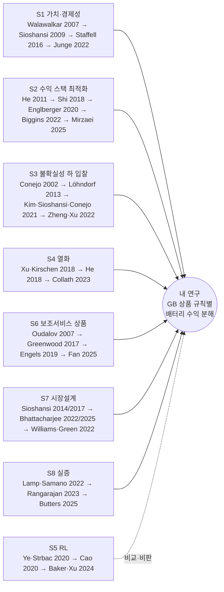

# 계보 지도: 내 연구는 어디에 서 있나

작성 2026-10-06, **2026-10-07 갱신**(경쟁 논문 반영: §1, §3, §6). 아카이브 110편(`INDEX.md`), 갈래별 종합(`streams/`), 연구 그룹(`GROUPS.md`), 교과서·리뷰(`CANON.md`)를 바탕으로 정리했습니다. 괄호 안 `id`는 `papers/<id>.md` 파일입니다.

## 1. 한 문장 위치

**배터리 입찰·운영 최적화(S2·S3·S4)는 시장 규칙을 고정된 환경으로 두고, 시장설계 연구(S7)는 규칙을 바꾸되 배터리 운영을 단순화하며, 실증 연구(S8)는 실제 행동을 보되 규칙별 원인을 분리하지 못했다.** 이 셋이 만나는 자리, 즉 *같은 배터리·같은 데이터·같은 최적화기에 상품 규칙만 바꿔 가며 수익을 규칙별로 분해하고, 실제 유닛 데이터로 검증하는 연구*는 8개 갈래 모두에서 "공백"으로 지목됐습니다(S1 gap 1, S2 gap 1, S4 gap 1, S5 gap 1, S6 gap 1, S7 gap 1, S8 gap 1–3).

> **2026-10-07 갱신 — 공백이 좁아졌습니다.** 위 결론은 2026년 경쟁 논문을 확인하기 전에 쓴 것입니다(`WATCHLIST.md`).
> - **더 이상 공백이 아닌 것**: ① GB 규칙을 MILP 제약으로 넣은 수익 스택 모델(`casella2024_ukbessmilp`, Q1; Xia et al. 2026 프리프린트는 EAC 공동최적화·SoE 규칙까지), ② BM 참여와 skip rate의 수익 효과(`gale2026_balancingbatteries`, Q1), ③ 한 모델로 여러 나라를 비교하는 연구(`landy2026_hybridstacking`, Q1 — 단, 시장 접근 "묶음" 단위).
> - **여전히 공백인 것**: ① 개별 상품 규칙을 on/off 반사실로 바꾸고 Shapley 등으로 **규칙별로 수익을 귀속**하는 것, ② 같은 규칙의 가치가 **국면(2021–22 호황 vs EAC 이후)**에 따라 어떻게 달라지는지, ③ BM 채택 확률을 **실증 추정**해 skip을 모수가 아닌 모형으로 넣는 것, ④ 실제 배터리 유닛의 공개 데이터 수익 재구성과 최적 벤치마크 비교.
> - 계보상 위치: Staffell 계열(staffell2016 → Schmidt & Staffell 2023 → Gale 2026·Landy 2026)의 바로 옆, 엔진은 Oxford 계열(Xia 2026)과 같은 층.

## 2. 갈래별 "사조"(모델링 관례)와 내가 물려받는 것

| 갈래 | 지배적 관례 (CANON.md의 Convention) | 내가 가져갈 것 | 내가 벗어날 지점 |
|---|---|---|---|
| S1 가치·경제성 | 가격수용자 LP, 완전예측 상한 + "예측 시 75–95% 회수" | 완전예측 상한 + 롤링 하한의 사다리 (staffell2016, mcconnell2015) | 시장·연도 비교가 아니라 **규칙 하나씩** 비교 |
| S2 수익 스택 | 일/블록 단위 MILP, 용량을 서비스별로 동적 배분, 규칙에서 유도한 SoE 대역 | 규칙→제약 변환 방식 (biggins2022의 30분 SoE 대역, mirzaeialavijeh2025의 시간별 FCR 전환) | 규칙을 **실험 변수**로 (S2 gap 1) |
| S3 입찰 | 2단계 SP, 비예견성, 가격결정자는 MPEC | VSS 개념: 실시간 재조정이 자유로우면 확률적 입찰 가치 0 (kim2021_vss) | EAC(D-1 확정) vs BM(실시간)의 규칙 차이가 VSS를 바꾸는지 |
| S4 열화 | rainflow 사이클 비용 → 구간선형, 기회비용으로서의 열화 가격 | 사이클+캘린더 열화를 고정한 채 규칙만 변화 (S4의 "minimal degradation spec") | 열화 가격을 교체비용 대신 기회비용으로 (he2018, xu2022) |
| S5 RL | DRL 정책을 과거 가격으로 학습 | 쓰지 않음. 대신 "왜 RL이 귀속 분석에 위험한가" 근거로 인용 | seed 분산 1–3%, 설계 선택만으로 20–51% 변동 (S5 stream 참조) |
| S6 보조서비스 | 상품 사양(응답·데드밴드·에너지 요건)이 최적 용량과 수익을 결정 | 15개 규칙 파라미터 목록 (S6 stream "Product-rule parameters") | DM/DR·EAC 이후 GB는 Q1 문헌 공백 |
| S7 시장설계 | 통제된 반사실 시뮬레이션, 요인설계, 쌍대변수로 수익 분해 | P1–P7 귀속 패턴 (S7 stream §5) | 미국 공동최적화 시장 중심 → 유럽형 순차·자기급전 시장 |
| S8 실증 | 이벤트 스터디, DiD, 관측 행동 vs 최적 벤치마크 | lamp2022의 "관측 vs LP 최적" 비교 설계 | 유닛 단위 다중상품 데이터는 아무도 안 씀 (GB EAC가 가능) |

## 3. 나와 비슷한 것을 시도한 사람들은 모델을 어떻게 만들었나

가장 가까운 14편(+2026-10-07 추가 3편, 모두 초록 수준)을 "가정 → 제약 → 모델 → 데이터 → 정당화" 순으로 요약했습니다. 세부는 각 파일 §2–§6.

| 논문 | 가정 | 모델을 강제한 제약 | 모델 | 데이터·가공 | 정당화 |
|---|---|---|---|---|---|
| biggins2022_tradeornot (GB) | 가격수용자, 월 단위 DA 가격 완전예측, 불확실성은 **낙찰 여부** | 30분 전출력 대기 의무 → SoC 여유대 + 이진 플래그 | MILP + 500개 몬테카를로 낙찰 시나리오 | NGESO FFR 낙찰 보고서, N2EX DA, 1초 주파수 | 낙찰 불확실성 무시 시 수입 28% 과대평가를 보임 |
| mirzaeialavijeh2025_swedenfcrstacking | 완전예측 오라클("입찰 알고리즘 아님"이라 명시) | 최소 입찰량·충방전 배타 → 이진, 시간 입찰을 1분 SoE로 추적 | 일 단위 MILP 365회, 열화 구간선형 | ENTSO-E, eSett, SVK, Fingrid 1분 주파수 (2022) | 5개 시장 조합 비교, 열화 포함/제외 비교 |
| fan2025_dccolocatedreforms (GB DC) | DC 규칙 상세 반영(15분 MER, 20% 회복, 기준선 램프) | 초 단위 주파수·다년 열화 → NPV가 매끄럽지 않음 | 시뮬레이션 + PSO 사이징 | NGESO 주파수, N2EX, Elexon 정산가 2016–19 | 연 1,460 EFA 블록 중 거의 전부 규칙 준수 확인 |
| engels2019_fcrgermanytechnoeco | FCR 규칙(데드밴드, 30분 에너지, 과이행 20%) | 페널티는 희귀사건 → 기회제약 SAA | 기회제약 SAA + 전기·열·열화 시뮬 | 대륙 유럽 10초 주파수 2014–17, 140,256 일 샘플 | 이항분포 신뢰구간으로 페널티 확률 ≤0.5% 보장 |
| xu2018_regdparticipation (PJM) | RegD 신호 에너지 평균 0 가정, 가격수용자 | rainflow 비용은 비마르코프 → 대규모 SP 회피 | 임계값 정책 + 후회(regret) 상한 증명 | PJM RegD 신호·가격 1년 | 이론적 regret bound, 1년 백테스트 |
| kim2021_vss | 2단계(DA 확정 → RT 조정), 선형 가격반응 | 가격 영향 반영하면서 풀 수 있어야 → 선형 가정 | 2단계 SP (IPOPT) | PJM 가격을 부하·기온 회귀 + SARIMA로 100 시나리오 | **명제: RT 조정이 자유롭고 가격수용자면 VSS=0** |
| mcconnell2015_energyonly (NEM) | 가격수용자, 완전예측 + 실제 pre-dispatch 예측 | 다년·다지역 비교 → 투명한 LP | LP, 롤링 재최적화 | AEMO 30분 가격·예측 2002–14 | 예측으로 상한의 ~85% 회수 → 상한이 의미 있음 |
| staffell2016_maxvalue (GB) | 가격수용자, STOR 이용 프로파일 고정 | 솔버 없이 쓰는 공개 도구 | 탐욕 페어링 (LP 최적과 일치 검증) | GB 30분 가격 2013/14, STOR | LP와 동일 해, 예측 시 75–95% |
| bhattacharjee2022_soemanagement | 가격결정 저장장치, 경쟁자 고정 | 운영자 청산 반응 → 이중수준 | MPEC (KKT) MILP | 앨버타 2015 | **같은 자산·시나리오에서 규칙만 요인설계로 변경** |
| williams2022_marketpower (GB) | 2×2 시장지배력 설계, 일 단위 완전예측 | 가격 내생성 필요 → 개선된 merit-order | 볼록 최적화(쿠르노 등가) | NG 30분 수요 2014, renewables.ninja | 요인별 반사실로 각 시장지배력 원천 분리 |
| lamp2022_caisobatteryarbitrage | 관측 행동 vs 완전예측 LP | 유닛 패널 없음 → 함대 단위 | 분위 회귀(관측 vs LP 최적 응답곡선), 이벤트 스터디 | CAISO OASIS 5분, EIA-860 | 같은 회귀를 LP 해에 적용해 비교(현시선호 검정) |
| butters2025_soakingsun (Econometrica) | 경쟁적 주변부, 확률적 운영 | 실제 배터리 운영 데이터 거의 없음 → 공급곡선 추정 | 동적 균형 구조모형 | CAISO 2016–19 | 확률적 운영이 완전예측의 ~70%, 수익의 69%가 상위 1% 구간에서 |
| he2018_intertemporal (Nature Energy) | 가격수용자, 수명 전체 | 15년 문제를 일 단위로 쪼개야 함 | 라그랑주 분해 → 열화의 한계가치(MBU) | CAISO 에너지·조정 2016 | 교체비용 기반 열화가격 대비 수명수익 큰 차이 |
| mercier2023_eudaarbitrage | 유럽 다국가 DA 차익거래 | 비교 가능성 | LP | 유럽 DA 가격 | **규칙 하나(계통요금)** 효과 분리: 가치 20–50% 감소 |
| gale2026_balancingbatteries (GB, **경쟁 C1**) | (초록 수준) DA+BM 공동최적화, skip rate를 모수로 | 미확인 | 공동최적화(형식 미확인) | GB 30분 가격 3년 | BM 참여 시 DA 단독 대비 최대 +250%, skip +10%p당 이익 −7% |
| landy2026_hybridstacking (UK+다지역, **경쟁 C2**) | (초록 수준) 열화·효율 반영 수익 스택 | 미확인 | 최적화(형식 미확인) | 미확인 | "입지보다 시장 접근·운전 제약이 수익성을 좌우" |
| casella2024_ukbessmilp (GB) | (초록 수준) GB 시장 규칙을 제약으로 | 계산량 → 선형화 | MILP (DA·ID·동적 주파수응답·불균형) | 미확인 | 미확인 — 우리 층 1과 가장 가까운 Q1 선례 |

**공통 패턴**
- 정당화는 거의 항상 **"완전예측 상한 + 현실 정책 하한"의 사다리**로 합니다. 상한이 의미 있으려면 현실 정책이 상한의 75–95%를 회수한다는 점을 보여 줍니다(staffell2016, mcconnell2015, butters2025 ~70%).
- 규칙은 **제약식으로 번역**됩니다: 에너지 요건 → SoC 대역, 회복 규칙 → 구간별 SoC 복귀, 낙찰 → 이진변수. 이 번역 방식 자체가 결과를 바꾸므로 고정해야 합니다(S2 gap 2).
- 규칙 효과를 깔끔하게 보인 논문들(bhattacharjee2022, williams2022, mercier2023)은 모두 **같은 자산·같은 데이터에서 규칙만 바꾸는 통제 비교**를 썼습니다.

## 4. 연구 그룹 계보에서 본 위치 (GROUPS.md 요약)

- **최적화 입찰의 정통 계열**: Conejo(UCLM→OSU) → Morales, Pineda, Ruiz, Baringo, Kazempour (확인됨). Oren(Berkeley) → Sioshansi, Papavasiliou (확인됨). Kirschen(UW) → Bolun Xu(2018) → Columbia 그룹 Zheng 등 (확인됨). 이 세 계열이 S3·S4·S7의 뼈대입니다.
- **GB 실무·정책 계열**: Newbery·Green(Cambridge EPRG, Imperial), Staffell(Imperial), Strbac(Imperial). 사제 관계는 대부분 미확인입니다.
- **연구실과의 연결**: Seung Wan Kim 교수님은 Cambridge EPRG 방문연구원(2016–17)·박사후연구원(2018)이었고(확인됨), Hongseok Kim(서강대)과 Jeong, Kim & Kim (2023) *IEEE TEMPR* "DeepBid"를 공저했습니다(`jeong2023_deepbid`, 초록만 읽음). Vaasa의 Sinan Küfeoğlu 교수와 2019년 *Electricity Journal* 공저가 있습니다. Yong Tae Yoon(SNU) → Seung Wan Kim 사제 관계는 **미확인**입니다.

## 5. 이 계보 위에서 가능한 연구 방향 (교수님 주제와 별개로)

데이터(`../data/README.md`)와 공백 목록을 겹쳐 본 후보입니다. 위에서부터 데이터 준비도가 높습니다.

1. **규칙 귀속 반사실 연구** (S2·S6·S7 공백): 하나의 MILP, GB 상품 규칙을 스위치로, Shapley 또는 요인설계로 분해, 쌍대변수로 "어느 제약이 수익을 만드나" 분해(S7 P4). 데이터 준비 완료.
2. **유닛 단위 실증** (S8 공백 1–3): EAC 유닛 결과 + Elexon BM으로 실제 배터리 230개의 서비스 배분이 QR 도입(2024-12), BR 공동경매 편입(2025-10), SR 도입(2026-03)에서 어떻게 바뀌었는지 이벤트 스터디. lamp2022처럼 관측 행동을 최적 벤치마크와 비교. `--units` 데이터 필요.
3. **GB 규칙에서의 확률적 입찰 가치(VSS)** (S3 gap 3): kim2021_vss의 명제를 GB에 적용. EAC는 D-1 확정, BM은 실시간이라 VSS가 0이 아닐 조건이 생김. 최적화 이론과 맞닿는 주제.
4. **인증 가능한 입찰 정책 경계** (S3 gap 7): 정보완화(information relaxation) 쌍대 상한으로 롤링 정책의 최적성 격차를 인증. lohndorf2013_addp 계열. "certifiable" 방향과 맞음.
5. **CM 디레이팅 변화의 효과** (S7 gap 2): 2시간 배터리 디레이팅이 0.567(2022/23 T-4) → 0.220(2029/30 T-4)으로 떨어진 것을 데이터로 확인함. 이 규칙 변화가 투자 지속시간 선택(2h→4h 이동)과 수익성에 준 효과. 데이터 준비 완료.

## 6. 반드시 먼저 확인할 것 (2026-10-07 갱신)

- **경쟁 논문**: 아카이브에 추가함 — `gale2026_balancingbatteries`(C1), `landy2026_hybridstacking`(C2), 프리프린트 C3–C5는 `WATCHLIST.md`. 셋 다 **초록 수준**이라 본문 확보 후 "그들이 한 것 / 안 한 것" 표를 확정해야 합니다(`DOWNLOAD_LIST.md` 1순위).
- **초록만 읽은 45편**: 수치를 인용하기 전에 전문 확인 필요. 영국 관련은 `DOWNLOAD_LIST.md`에 정리.
- **분위 규칙 미달·미확인**: `INDEX.md`의 `Q2!` 3편(staffell2016, jiang2023, kirkpatrick2026)은 남길지 결정 필요. `Q1?` 24편은 발행연도 SJR 재확인 필요.
- **미확인 사제 관계**: GROUPS.md 말미 체크리스트.
